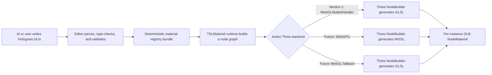

# GDevelop TSL Material System Extension

## AI-authorable Three.js node materials for GLB models

**Status:** Proposed, codebase-aligned implementation specification

**Date:** 2026-08-15

**Baseline:** GDevelop branch `working` at
`10477eec9d3d31ea25fd36ac0ee24a1a6390678b`, Three.js `0.185.1`, and
PixiJS Legacy `7.4.2`

**Target:** GDevelop editor, built-in extensions, GDJS runtime, GLB model
rendering, preview, and export

Related specifications:

- [GDevelop architecture](Architecture.md)
- [GDevelop TypeScript code events](gdevelop-typescript-event-spec.md)
- [GDevelop JavaScript authoring API](gdevelop-javascript-authoring-api-spec.md)
- [GDevelop multi-file project format](gdevelop-new-formats-spec.md)
- [3D toolchain semantic validation and runtime verification](gdevelop-3d-toolchain-semantic-validation-and-runtime-verification-spec.md)
- [Spring-bone dynamics system extension](spring-bone-dynamics-system-extension-spec.md)
- [Cloth simulation system extension](cloth-simulation-system-extension-spec.md)

> Approval gate: this document specifies a proposed implementation. It does
> not approve production code changes. Implementation begins only after the
> resource format, authoring API, runtime bundle strategy, and Model3D lifecycle
> seam in this document are explicitly approved.

---

## Contents

1. [Executive decision](#1-executive-decision)
2. [Current codebase baseline](#2-current-codebase-baseline)
3. [Goals and non-goals](#3-goals-and-non-goals)
4. [Terminology and invariants](#4-terminology-and-invariants)
5. [Version-one capability contract](#5-version-one-capability-contract)
6. [System architecture](#6-system-architecture)
7. [Project resource model](#7-project-resource-model)
8. [TSL source module contract](#8-tsl-source-module-contract)
9. [Authoring API and virtual modules](#9-authoring-api-and-virtual-modules)
10. [Editor compiler contract](#10-editor-compiler-contract)
11. [Shader generation contract](#11-shader-generation-contract)
12. [Runtime packaging and Three.js identity](#12-runtime-packaging-and-threejs-identity)
13. [Current WebGL renderer integration](#13-current-webgl-renderer-integration)
14. [Future WebGPU renderer integration](#14-future-webgpu-renderer-integration)
15. [GLB material binding](#15-glb-material-binding)
16. [Material conversion and ownership](#16-material-conversion-and-ownership)
17. [Parameters, selectors, behavior, and events](#17-parameters-selectors-behavior-and-events)
18. [Runtime lifecycle and state machine](#18-runtime-lifecycle-and-state-machine)
19. [Diagnostics and fallback behavior](#19-diagnostics-and-fallback-behavior)
20. [Security and reliability](#20-security-and-reliability)
21. [Editor and AI authoring experience](#21-editor-and-ai-authoring-experience)
22. [Preview and export](#22-preview-and-export)
23. [Caching, performance, and limits](#23-caching-performance-and-limits)
24. [Implementation map and phases](#24-implementation-map-and-phases)
25. [Testing requirements](#25-testing-requirements)
26. [Acceptance criteria](#26-acceptance-criteria)
27. [Rejected alternatives](#27-rejected-alternatives)
28. [Resolved and deferred decisions](#28-resolved-and-deferred-decisions)
29. [Upstream references](#29-upstream-references)

---

## 1. Executive decision

GDevelop should add a built-in system extension named **TSL Material** with the
stable extension namespace `TSLMaterial`.

The feature is based on these decisions:

1. A material is authored as a first-class project resource whose canonical
   source is a `.tsl.ts` file, for example `Hologram.tsl.ts`.
2. The file contains JavaScript/TypeScript that constructs a Three.js Shader
   Language (TSL) node graph. TSL is not treated as a new textual shader
   language.
3. An AI model may generate this source directly against a small, versioned,
   typed authoring API.
4. The editor validates and bundles the source, but it does **not** implement a
   TSL-to-WGSL compiler and does not persist generated WGSL or GLSL.
5. At runtime, the Three.js node system and `NodeBuilder` generate the shader
   required by the active renderer backend:
   - WGSL when a future WebGPU renderer selects the WebGPU backend;
   - GLSL when the current or future renderer selects a WebGL backend.
6. Version one keeps GDevelop's existing `THREE.WebGLRenderer`, Pixi renderer,
   shared WebGL context, per-layer render ordering, and legacy post-processing
   chain.
7. Version one enables node materials on that renderer through the exact
   version-matched Three.js `WebGLNodesHandler` compatibility layer.
8. A GLB material override is created per model instance. It may share the
   cached GLB's textures and geometry, but it must never modify or dispose the
   cached GLB's materials, textures, or geometry.
9. TSL surface materials and TSL post-processing are separate features. This
   specification includes the former and deliberately excludes the latter from
   version one.

This produces a practical first release without forcing a simultaneous Pixi 8,
WebGPU, render-graph, or editor architecture migration.

The intended pipeline is:



The editor's generated JavaScript is an execution artifact. The TSL source is
the only user-editable material source.

---

## 2. Current codebase baseline

This design depends on the following current implementation facts.

### 2.1 Renderer topology

- `newIDE/app/package.json` pins Three.js `0.185.1` and PixiJS Legacy `7.4.2`.
- `GDJS/Runtime/pixi-renderers/runtimegame-pixi-renderer.ts` creates a
  `THREE.WebGLRenderer` first, then creates the Pixi renderer on the same canvas
  and WebGL context.
- `GDJS/Runtime/pixi-renderers/runtimescene-pixi-renderer.ts` renders Three
  content per layer and interleaves it with the existing 2D layer pipeline.
- `GDJS/Runtime/pixi-renderers/layer-pixi-renderer.ts` owns each layer's Three
  scene, camera, group, and legacy `EffectComposer` chain.
- The layer renderer also bridges Pixi render textures into Three by using
  WebGL-specific texture internals. A renderer-backend change therefore affects
  substantially more than the 3D material class.
- The shipped `GDJS/Runtime/pixi-renderers/three.js` is a browser-global Three
  bundle. `ThreeAddons.js` is built against that same global identity.

Consequently, replacing `WebGLRenderer` with `WebGPURenderer` is not a valid
hidden implementation detail of this feature. It is a separate renderer
migration with separate acceptance criteria.

### 2.2 GLB and Model3D lifecycle

- `GDJS/Runtime/Model3DManager.ts` caches loaded GLTF resources and explicitly
  requires callers to clone them before modification.
- `Extensions/3D/Model3DRuntimeObject3DRenderer.ts` clones a model with
  `SkeletonUtils.clone` and applies GDevelop's existing material mode before the
  clone is added to the scene.
- A cloned model intentionally shares source geometry, materials, and textures
  with the cached GLTF. The renderer's release path must not dispose those
  shared assets.
- Reloading a Model3D object replaces its Three hierarchy and advances a private
  model generation. Any material system that remembers mesh references must
  rebind when that generation changes.
- Model3D currently supports `KeepOriginal`, `Basic`, and
  `StandardWithoutMetalness` material modes. TSL overrides must run after this
  built-in conversion so their source material is the material that GDevelop
  would otherwise render.

### 2.3 Extension and frame lifecycle

- Built-in JavaScript extensions can declare runtime include files.
- GDJS exposes scene-loaded, pre-events, post-events, and scene-unloaded
  callbacks. Existing simulation system extensions use the post-events and
  scene-unloaded callbacks successfully.
- The runtime game renderer exposes the current Three renderer.

These seams are sufficient for a system extension, except for one narrow
Model3D hierarchy-change notification defined in section 15. No general renderer
rewrite is required.

### 2.4 Three.js node-material baseline

Three.js `r185` includes:

- TSL node functions and node materials;
- backend-dependent node building and shader generation;
- `WebGLRenderer.setNodesHandler`;
- the version-matched `WebGLNodesHandler` compatibility implementation.

The compatibility handler is useful but intentionally incomplete. Its upstream
source calls out limitations including VSM shadows, MRT, transmission, storage
textures, the WebGPU post-processing stack, automatic fog/environment updates,
and renderer pre-compilation. Those limitations form part of this
specification's version-one contract; they are not implementation bugs to hide.

---

## 3. Goals and non-goals

### 3.1 Goals

Version one must:

- let a user or AI create a reusable custom material by writing TSL directly;
- provide TypeScript declarations, completion, examples, and deterministic
  diagnostics for that source;
- apply custom node materials to all or selected mesh/material slots of a GLB;
- support static, skinned, morph-targeted, and multi-material GLB models without
  corrupting their shared cached resources;
- expose typed runtime parameters that GDevelop events can change without
  rebuilding the graph;
- preserve the existing renderer, layer ordering, Pixi filters, and legacy Three
  post-processing behavior;
- work in editor preview and exported games without a network connection;
- include TSL runtime code only when a project uses a TSL material;
- keep authored source portable to a future WebGPU renderer whenever it uses the
  portable API subset;
- fail safely and restore or retain the original material when compilation,
  capability checks, resource loading, or runtime graph construction fails;
- provide enough structured diagnostics for an AI coding loop to repair the
  source without scraping console text.

### 3.2 Non-goals

Version one does not:

- replace the current Three WebGL renderer;
- migrate PixiJS to WebGPU or PixiJS 8;
- create a unified WebGPU render graph for 2D and 3D content;
- replace Pixi filters or GDevelop's existing Three `EffectComposer` passes with
  TSL post-processing;
- expose compute shaders, storage textures/buffers, MRT, ray tracing, or
  WebGPU-only functionality;
- accept raw WGSL, raw GLSL, `ShaderMaterial`, `RawShaderMaterial`, or
  `onBeforeCompile` hooks;
- guarantee that every Three.js TSL node or every Three node material works on
  the `r185` WebGL compatibility handler;
- translate arbitrary npm packages or arbitrary JavaScript imports into an
  exported game;
- provide a visual node-graph editor in the first release;
- make untrusted material source a strong security sandbox;
- serialize backend-generated shaders as authoritative project data;
- add a runtime action that accepts source code as a string.

---

## 4. Terminology and invariants

### 4.1 Terms

| Term                | Meaning                                                                                                                       |
| ------------------- | ----------------------------------------------------------------------------------------------------------------------------- |
| TSL source          | The authoritative `.tsl.ts` project file written by a user or AI.                                                             |
| Material definition | The default export returned by `defineMaterial`. It contains metadata, parameters, and a synchronous graph-building function. |
| Material resource   | The GDevelop resource entry that names a TSL source file.                                                                     |
| Registry bundle     | Deterministically generated JavaScript that registers validated material definitions with GDJS.                               |
| Source material     | The material on a cloned GLB slot after GDevelop's built-in material mode has run.                                            |
| Owned material      | A node material created by `TSLMaterial` for one model instance.                                                              |
| Binding             | A named association between an object, material resource, selector, and parameter set.                                        |
| Slot                | One `mesh.material` position; arrays therefore create multiple slots.                                                         |
| Graph build         | Synchronous execution of the material definition to assign nodes to an owned node material.                                   |
| Shader build        | Three.js analysis and generation of backend shader source for a graph and render state.                                       |
| Portable subset     | TSL and material features supported by both the WebGL compatibility target and the future WebGPU target.                      |

### 4.2 Invariants

The implementation must preserve all of these invariants:

1. There is exactly one Three.js core identity in a running game.
2. The Three core, TSL functions, node-material classes, and nodes handler come
   from the exact same pinned Three.js revision.
3. The editor never implements its own semantic TSL-to-WGSL or TSL-to-GLSL
   compiler.
4. Generated WGSL or GLSL is an internal renderer cache, not project source.
5. A TSL binding never mutates or disposes a material, texture, or geometry owned
   by the cached GLTF.
6. Every owned material has one explicit runtime owner and is disposed exactly
   once.
7. Removing a binding restores the exact original material object or material
   array for the current model generation.
8. Graph topology is built outside the per-frame update path.
9. Uniform changes do not rebuild graph topology.
10. A material error cannot make the whole object permanently lose its original
    material.
11. Source validation and export are deterministic for equal source, compiler,
    Three version, and options.
12. The runtime does not use `eval`, `new Function`, or dynamic module imports to
    load a material.
13. A TSL material cannot depend on private `gdjs`, renderer, Pixi, DOM, or Three
    internals.

---

## 5. Version-one capability contract

The UI, compiler, runtime, documentation, and AI prompt must describe the same
capability matrix.

| Capability                                                       | Version-one status                   | Required behavior                                                                                                |
| ---------------------------------------------------------------- | ------------------------------------ | ---------------------------------------------------------------------------------------------------------------- |
| GLB `MeshStandardMaterial`                                       | Supported                            | Convert to a per-instance `MeshStandardNodeMaterial`, copy source properties, then apply graph nodes.            |
| GLB `MeshBasicMaterial`                                          | Supported                            | Convert to a per-instance `MeshBasicNodeMaterial`.                                                               |
| GLB `MeshPhysicalMaterial` without transmission                  | Supported after conformance tests    | Convert to `MeshPhysicalNodeMaterial`; reject unsupported source features.                                       |
| Transmission/refraction                                          | Unsupported                          | Emit `TSL-RUN-004` and keep the original material.                                                               |
| Skinning                                                         | Supported                            | Preserve skeleton bindings and skinning defines; covered by browser tests.                                       |
| Morph targets                                                    | Supported                            | Preserve morph-target behavior; covered by browser tests.                                                        |
| Material arrays and geometry groups                              | Supported                            | Replace and restore individual slots without collapsing the array.                                               |
| Vertex deformation                                               | Supported portable subset            | Use node-material vertex/position nodes; must preserve skinning and morph composition.                           |
| PBR color, emissive, opacity, roughness, metalness, normal nodes | Supported portable subset            | Validate against the versioned declarations and conformance suite.                                               |
| Alpha blend and alpha test                                       | Supported                            | Render state is declared statically or inherited; sorting remains Three's responsibility.                        |
| Standard shadows                                                 | Supported with tests                 | VSM is excluded; shadow behavior must match the current renderer configuration.                                  |
| Fog and environment changes                                      | Supported with explicit invalidation | Rebuild/dispose affected owned materials when the scene inputs change; do not rely on automatic handler updates. |
| Legacy Three `EffectComposer` after the scene render             | Unchanged                            | Existing passes continue to process the rendered scene.                                                          |
| Authoring a TSL post-processing graph                            | Unsupported                          | No pass/resource/event API in version one.                                                                       |
| Compute, storage texture/buffer, MRT                             | Unsupported                          | Reject during validation or capability negotiation.                                                              |
| Backend-native `wgslFn` or `glslFn` escape                       | Unsupported                          | Portable materials cannot contain backend-native source.                                                         |
| Direct raw shader source                                         | Unsupported                          | No WGSL/GLSL string fields or runtime compilation API.                                                           |
| WebGPU output                                                    | Deferred renderer target             | Same material source must be reusable after the renderer migration.                                              |

`TSLMaterial` must reject a feature it cannot prove compatible. It must not
silently render a visually different approximation.

The conformance suite is the final authority for the portable subset. Merely
being exported by `three/tsl` does not make a node version-one supported.

---

## 6. System architecture

### 6.1 Components

The feature consists of six bounded components:

1. **`TSLMaterialResource`** stores the source-file reference in the project
   resource registry.
2. **Material editor service** loads source, provides declarations, requests
   validation, displays diagnostics, and exposes AI authoring context.
3. **Material compiler service** validates the restricted TypeScript/TSL module,
   extracts the manifest, and emits a deterministic registry artifact.
4. **TSL runtime bundle** provides the version-matched TSL functions,
   node-material constructors, compatibility handler, and stable adapter API.
5. **`TSLMaterialSystem`** is scene-owned runtime state for bindings, graph
   construction, uniform updates, invalidation, and cleanup.
6. **Model material-host seam** reports cloned Model3D hierarchy replacement so
   bindings are applied before the hierarchy's first render and released when
   it is replaced.

### 6.2 Ownership

| Data or object                       | Owner                              | Lifetime                                     |
| ------------------------------------ | ---------------------------------- | -------------------------------------------- |
| TSL source                           | Project resource                   | Project lifetime                             |
| Compiler receipt/cache entry         | Editor compiler service            | Editor cache; regenerable                    |
| Registry definition                  | Runtime registry                   | Game lifetime                                |
| Scene binding state                  | `TSLMaterialSystem`                | Runtime scene lifetime                       |
| Owned node material                  | One binding/material-instance pair | Current model generation or binding lifetime |
| Parameter uniform node               | One binding instance               | Binding lifetime                             |
| Source GLB texture/geometry/material | GLTF cache / existing Model3D path | Existing resource-manager lifetime           |
| Renderer shader/program              | Three renderer                     | Three's existing renderer cache lifetime     |

### 6.3 No architectural backdoor

The system extension must not:

- replace the game renderer;
- render the scene a second time;
- create another canvas or WebGL context;
- traverse every object or mesh every frame;
- reach into Pixi's private WebGL texture map;
- load an ESM copy of `three`, `three/webgpu`, or `three/tsl` at runtime;
- patch a material with `onBeforeCompile`.

---

## 7. Project resource model

### 7.1 Resource kind

Add a dedicated GDevelop resource kind:

```text
tslMaterial
```

The corresponding core resource type is `TSLMaterialResource`. Reusing the
generic JavaScript resource kind is rejected because material resources require
different validation, references, export inclusion, editor UI, and security
rules.

The canonical filename suffix is:

```text
<MaterialName>.tsl.ts
```

For example, the `Hologram` resource is normally stored as
`materials/Hologram.tsl.ts`.

The final extension remains `.ts`, so TypeScript-aware editors, language
servers, formatters, and Git hosting recognize the file without a custom file
association. The preceding `.tsl` segment communicates the domain in the same
way that `.spec.ts` or `.test.ts` communicates a TypeScript file's role.

TypeScript is used for declarations and diagnostics. After erasing type-only
syntax, the executable body is ordinary JavaScript that calls TSL functions.
This is direct TSL authoring, not an intermediate shader DSL.

The following alternatives are rejected for the canonical version-one name:

- `.gdmaterial.ts` is proprietary-looking, redundant with the resource kind,
  and visually resembles an unknown compound extension;
- `.tsl` does not tell normal tooling to parse the file as JavaScript or
  TypeScript;
- `.material.ts` is too generic and does not distinguish TSL from future visual
  or backend-native material formats;
- `.tsl.js` loses the strongest authoring-time type checking, although optional
  JavaScript authoring can be considered later.

### 7.2 Serialized entry

Legacy project JSON uses the existing resource-container shape:

```json
{
  "kind": "tslMaterial",
  "name": "Hologram",
  "file": "materials/Hologram.tsl.ts",
  "userAdded": true
}
```

The resource name is the stable project-level identity used by behaviors and
events. The file path may be renamed through the resource UI without rewriting
every binding.

No compiled JavaScript, generated shader, source hash, or parameter schema is
serialized into the authoritative resource entry. These are derived artifacts.

### 7.3 Multi-file projects

In the multi-file project format, `resources.settings` continues to own the
entire resource registry. The `.tsl.ts` file remains a sibling project
asset referenced by its `tslMaterial` entry. This specification does not create
a second material registry in `project.gdevelop` or a new root settings file.

### 7.4 Reference tracking

The editor must index references from:

- `TSLMaterial::Material` behavior properties;
- `TSLMaterial` event-instruction resource parameters;
- future prefab or custom-object properties that use the same resource type.

Resource rename, missing-resource warnings, unused-resource detection, and
export dependency discovery must use this index.

Only referenced TSL material resources are compiled into a preview or export.
An option may include all resources for debugging, but it is not the default.

### 7.5 Versioning

Each source definition declares `apiVersion: 1`. The project resource format
does not embed a Three.js version. The compiler receipt records the exact Three
revision and authoring-API version that validated and emitted the definition.

### 7.6 Generated TSL authoring catalogs

The editor should extend the existing `.gdevelop` catalog-generation pipeline
that already writes `runtime-api.d.ts`, `project-api.d.ts`, and
`harness-api.d.ts`. It adds these generated artifacts:

| Artifact                     | Responsibility                                                                                                                                                          |
| ---------------------------- | ----------------------------------------------------------------------------------------------------------------------------------------------------------------------- |
| `.gdevelop/tsl-api.d.ts`     | Compact, reviewed TypeScript declarations for `@gdevelop/tsl`, the allowed `three/tsl` subset, branded node types, material facades, parameters, and authoring context. |
| `.gdevelop/tsl-catalog.json` | Machine-readable symbol cards, backend/stage capabilities, unsupported combinations, example IDs, diagnostic repair guidance, and authoring-pack identity.              |

`tsl-api.d.ts` is the primary source of truth for TypeScript language services,
the material compiler, external editors, and AI code generation. The JSON file
contains semantic information that TypeScript declarations cannot express well,
such as whether a node is disallowed by the WebGL compatibility profile or which
conformance fixture must validate it.

The declaration contains ambient modules rather than importing a physical npm
package:

```ts
declare module "@gdevelop/tsl" {
  export function defineMaterial<
    TParameters extends Record<string, ParameterDefinition>
  >(
    definition: MaterialDefinition<TParameters>
  ): MaterialDefinition<TParameters>;
}

declare module "three/tsl" {
  export const time: FloatNode;
  export function sin(value: FloatNodeLike): FloatNode;
  export function mix<T extends Node>(from: T, to: T, factor: FloatNodeLike): T;
  // Only the reviewed portable subset is emitted.
}
```

The actual generated declarations are complete for the approved surface. The
short fragment above only illustrates the module shape.

The generator must **not** reflect and expose every export found in the installed
Three package. Like the reviewed gameplay-test harness declaration, it starts
from a checked-in allowlist/facade model. Otherwise experimental, backend-only,
private, or untested TSL functions would accidentally become an AI-facing public
contract whenever Three is upgraded.

The generated header includes at least:

```text
// Generated by GDevelop. Do not edit.
// tslAuthoringApiVersion: 1
// threeRevision: 185
// portableProfileVersion: 1
// projectApiHash: sha256:...
// tslCatalogHash: sha256:...
// tslApiHash: sha256:...
```

The declaration may reference reviewed resource-name types from
`project-api.d.ts`, for example image resources accepted by texture parameters.
Detailed mesh/material metadata is deliberately not copied into the declaration;
it remains available on demand through `inspect_model_materials` to avoid huge
catalogs for complex GLBs.

### 7.7 Catalog lifecycle and integrity

The two TSL catalog files follow the existing generated-catalog contract:

- they are derived editor state under `.gdevelop/`, ignored by Git, and never
  authoritative project source;
- an AI model and user must never edit them;
- manual project save and the existing explicit `generate-catalogs` operation
  regenerate, write, and verify them together with the current catalogs;
- the editor also generates identical virtual contents in memory for unsaved,
  single-file, or cloud projects where `.gdevelop` cannot be written;
- source editor completion, compiler validation, AI context retrieval, and export
  validation consume the same content hashes;
- generation is deterministic for equal project model, Three revision,
  authoring API, allowlist, capability profile, and example set;
- a partial write, hash mismatch, or disagreement between `.d.ts` and JSON blocks
  AI activation, preview, and export of referenced TSL resources;
- generated catalogs are never packaged into a production game because the
  registry bundle already contains the validated runtime representation.

The catalog generator reports progress and result paths alongside the existing
catalog artifacts. The conceptual result adds:

```js
catalogFiles: {
  // Existing files omitted.
  tslApi: ".gdevelop/tsl-api.d.ts",
  tslCatalog: ".gdevelop/tsl-catalog.json"
}
```

Monaco loads `tsl-api.d.ts` only into the TSL material editor's TypeScript
language-service context. It must not make shader-only globals or modules appear
inside ordinary JavaScript events.

---

## 8. TSL source module contract

### 8.1 Canonical inherited-PBR example

`materials/Hologram.tsl.ts`:

```ts
import { defineMaterial } from "@gdevelop/tsl";
import { mix, sin, time } from "three/tsl";

export default defineMaterial({
  apiVersion: 1,
  base: "inherit",
  label: "Hologram",
  parameters: {
    tint: {
      type: "color",
      default: "#28d7ff",
      label: "Tint"
    },
    strength: {
      type: "number",
      default: 0.65,
      min: 0,
      max: 1
    },
    speed: {
      type: "number",
      default: 2,
      min: 0,
      max: 20
    }
  },
  build({ material, inputs, parameters }) {
    const pulse = sin(time.mul(parameters.speed))
      .mul(0.5)
      .add(0.5);
    const hologram = parameters.tint;

    material.colorNode = mix(inputs.baseColor, hologram, parameters.strength);
    material.emissiveNode = hologram.mul(pulse).mul(parameters.strength);
    material.opacityNode = inputs.opacity.mul(0.75);
    material.transparent = true;
    material.depthWrite = false;
  }
});
```

This material keeps the GLB's inherited base-color input, adds a user-controlled
tint and emissive pulse, and changes only documented render state. `time` and
all declared parameters are nodes, so no JavaScript frame callback is needed.

### 8.2 Minimal inherited tint example

`materials/Tint.tsl.ts`:

```ts
import { defineMaterial } from "@gdevelop/tsl";
import { mix } from "three/tsl";

export default defineMaterial({
  apiVersion: 1,
  base: "inherit",
  label: "Tint",
  parameters: {
    tint: {
      type: "color",
      default: "#ff8040",
      label: "Tint"
    },
    amount: {
      type: "number",
      default: 0.5,
      min: 0,
      max: 1
    }
  },
  build({ material, inputs, parameters }) {
    material.colorNode = mix(
      inputs.baseColor,
      parameters.tint,
      parameters.amount
    );
  }
});
```

This is the recommended smallest AI-generated example. It demonstrates that a
parameter declared as `color` is already exposed as a typed color uniform node;
the source must not read or mutate an internal `.value` field.

### 8.3 Vertex-wave example

`materials/VertexWave.tsl.ts`:

```ts
import { defineMaterial } from "@gdevelop/tsl";
import { normalLocal, positionLocal, sin, time } from "three/tsl";

export default defineMaterial({
  apiVersion: 1,
  base: "inherit",
  label: "Vertex wave",
  parameters: {
    amplitude: {
      type: "number",
      default: 0.08,
      min: 0,
      max: 1
    },
    frequency: {
      type: "number",
      default: 4,
      min: 0,
      max: 50
    },
    speed: {
      type: "number",
      default: 2,
      min: -20,
      max: 20
    }
  },
  build({ material, parameters }) {
    const phase = positionLocal.x
      .mul(parameters.frequency)
      .add(time.mul(parameters.speed));
    const displacement = sin(phase).mul(parameters.amplitude);

    material.positionNode = positionLocal.add(normalLocal.mul(displacement));
  }
});
```

The runtime conformance suite must verify this example on static, skinned, and
morph-targeted fixtures. Passing TypeScript alone is insufficient to prove that
vertex deformation composes correctly with a specific model's geometry path.

### 8.4 Custom unlit-output example

`materials/VerticalGradient.tsl.ts`:

```ts
import { defineMaterial } from "@gdevelop/tsl";
import { mix, uv, vec4 } from "three/tsl";

export default defineMaterial({
  apiVersion: 1,
  base: "custom",
  label: "Vertical gradient",
  parameters: {
    bottomColor: {
      type: "color",
      default: "#101030"
    },
    topColor: {
      type: "color",
      default: "#40d8ff"
    }
  },
  build({ material, parameters }) {
    const gradient = uv().y.saturate();
    const outputColor = mix(
      parameters.bottomColor,
      parameters.topColor,
      gradient
    );

    material.fragmentNode = vec4(outputColor, 1);
  }
});
```

`base: "custom"` is intended for deliberately unlit/full-output materials. An
AI should prefer `inherit` for GLB materials unless the request explicitly asks
to replace the normal lighting response.

### 8.5 Executable documentation requirement

Every complete source example in product documentation and AI context must have
a matching checked-in compiler fixture. CI must:

1. parse it as TypeScript;
2. type-check it against the release virtual declarations;
3. pass the AST/import/capability validator;
4. build the TSL graph for its declared base material;
5. run the applicable WebGL compatibility conformance fixture;
6. fail when documentation and fixture source diverge.

Examples are normative for the pinned GDevelop authoring API and Three revision.
They are not a promise that an upstream symbol remains available after a Three
upgrade. Upgrading Three requires revalidating and, if necessary, migrating the
examples before release.

### 8.6 Required module shape

A material source must:

- contain only allowed static imports;
- have exactly one default export;
- call `defineMaterial` directly for that export;
- declare `apiVersion: 1` as a literal;
- declare a literal, statically extractable manifest;
- provide exactly one synchronous `build` function;
- build graph topology without asynchronous work or per-frame JavaScript;
- mutate only the owned `material` object supplied in its context;
- return `undefined`.

Top-level execution is limited to imports, immutable literal constants, pure
helper-function declarations, and the default `defineMaterial` call. Top-level
side effects are invalid.

### 8.7 Base material modes

`base` accepts:

| Value      | Behavior                                                                                        |
| ---------- | ----------------------------------------------------------------------------------------------- |
| `inherit`  | Select the compatible node-material class from the source material. This is the default.        |
| `basic`    | Create an unlit `MeshBasicNodeMaterial` and copy compatible source properties.                  |
| `standard` | Create a `MeshStandardNodeMaterial` and copy compatible PBR properties.                         |
| `physical` | Create a `MeshPhysicalNodeMaterial`, subject to the active capability matrix.                   |
| `custom`   | Create a base `NodeMaterial`; the source must assign the required vertex/fragment/output nodes. |

The source does not import or instantiate material constructors. The runtime
owns class selection so all instances use the correct Three identity and can be
validated before mutation.

### 8.8 Static render state

The `build` function may set only the documented writable node and render-state
properties on the owned material. Examples include `colorNode`, `opacityNode`,
`emissiveNode`, `roughnessNode`, `metalnessNode`, `normalNode`, `positionNode`,
`fragmentNode`, `outputNode`, `transparent`, `depthWrite`, `depthTest`, `side`,
and `alphaTest` when supported by the selected base.

The versioned material facade is narrower than the full upstream class. An
unlisted field is a compile-time error even if it happens to exist in the pinned
Three release.

Render-state fields are graph-build-time constants. An event cannot toggle
`transparent`, blending, side, depth mode, or graph topology through a uniform.
Changing them requires selecting another material resource or rebuilding an
explicit future static variant.

### 8.9 No per-frame callback

The material definition has no `update`, `tick`, or `dispose` callback.

- Time, camera, object, viewport, and other renderer-provided values are nodes.
- User values are uniform nodes.
- Resource disposal belongs to `TSLMaterialSystem`.

This prevents every generated material from adding arbitrary frame-loop work and
makes the graph lifecycle auditable.

---

## 9. Authoring API and virtual modules

### 9.1 Allowed imports

Version one allows imports only from:

```text
@gdevelop/tsl
three/tsl
```

`@gdevelop/tsl` is a virtual, versioned authoring module. `three/tsl` is also
resolved virtually by GDevelop; it is not an npm dependency lookup from the
user's project.

The following are invalid:

- `three`, `three/webgpu`, `three/addons/*`, or deep Three paths;
- `gdjs` or GDevelop runtime implementation files;
- remote URLs;
- Node.js built-ins;
- arbitrary npm or local relative modules;
- dynamic `import()` and `require()`.

Pure helper functions must live in the same source file in version one. This
keeps dependency discovery and AI repair deterministic. A later material-library
resource can add multi-file composition without weakening this rule silently.

### 9.2 Material definition types

The public declarations are conceptually equivalent to:

```ts
type MaterialBase = "inherit" | "basic" | "standard" | "physical" | "custom";

type ParameterDefinition =
  | NumberParameter
  | BooleanParameter
  | ColorParameter
  | Vector2Parameter
  | Vector3Parameter
  | Vector4Parameter
  | TextureParameter;

interface MaterialDefinition<
  TParameters extends Record<string, ParameterDefinition>
> {
  readonly apiVersion: 1;
  readonly label?: string;
  readonly description?: string;
  readonly base?: MaterialBase;
  readonly parameters?: TParameters;
  readonly build: (context: MaterialBuildContext<TParameters>) => void;
}

declare function defineMaterial<
  TParameters extends Record<string, ParameterDefinition>
>(definition: MaterialDefinition<TParameters>): MaterialDefinition<TParameters>;
```

The checked-in reviewed declaration model and its deterministic
`.gdevelop/tsl-api.d.ts` projection are normative. The interface above explains
their shape but is not a replacement for the generated catalog or declaration
tests.

### 9.3 Build context

The build context exposes:

```ts
interface MaterialBuildContext<TParameters> {
  readonly material: GDevelopNodeMaterialFacade;
  readonly inputs: {
    readonly baseColor: ColorNode;
    readonly opacity: FloatNode;
    readonly emissive: ColorNode;
    readonly roughness: FloatNode;
    readonly metalness: FloatNode;
    readonly normal: Vector3Node;
  };
  readonly parameters: UniformNodesFor<TParameters>;
  readonly source: Readonly<{
    name: string;
    kind: "basic" | "standard" | "physical" | "unsupported";
    hasColorMap: boolean;
    hasNormalMap: boolean;
    hasSkinning: boolean;
    hasMorphTargets: boolean;
  }>;
}
```

`inputs` captures the inherited source-material channels before the definition
overrides any node field. This avoids accidental self-reference such as assigning
`colorNode` and then reading the new `colorNode` as its own input.

The context does not expose a runtime object, renderer, scene, mesh, DOM object,
WebGL context, GPU device, or mutable source material.

### 9.4 Parameter types

| Type      | Runtime node                                     | Event mutability | Notes                                                                           |
| --------- | ------------------------------------------------ | ---------------- | ------------------------------------------------------------------------------- |
| `number`  | Float or integer-compatible uniform node         | Yes              | Optional min, max, step, and UI label.                                          |
| `boolean` | Boolean uniform node                             | Yes              | No graph branching in JavaScript; use TSL selection/control flow.               |
| `color`   | Linear color uniform node                        | Yes              | Authoring default is an sRGB hex string; conversion is explicit in the adapter. |
| `vec2`    | `vec2` uniform node                              | Yes              | Default is a two-number tuple.                                                  |
| `vec3`    | `vec3` uniform node                              | Yes              | Default is a three-number tuple.                                                |
| `vec4`    | `vec4` uniform node                              | Yes              | Default is a four-number tuple.                                                 |
| `texture` | Texture node backed by a GDevelop image resource | Yes              | Texture ownership remains with the resource manager.                            |

Parameter names must match `/^[A-Za-z_][A-Za-z0-9_]*$/`. Names beginning with
`__` are reserved. Defaults are mandatory and must be literal, finite, and valid
for the declared type.

Parameters are per object binding. Two instances of the same GLB and material
resource can therefore have different values without getting different graph
topologies or modifying one another.

### 9.5 TSL control flow

TSL nodes are JavaScript objects. A JavaScript `if (parameters.enabled)` tests
the node object itself, not its future GPU value, and is therefore invalid.
Dynamic shader control flow must use the supported TSL conditional/select APIs.

The compiler must diagnose common host-language mistakes, including:

- coercing a node to a JavaScript number or boolean;
- reading or assigning a node's internal `.value`;
- branching in JavaScript on a parameter node;
- returning a promise;
- replacing the owned material;
- constructing a material, renderer, texture, or render target directly.

---

## 10. Editor compiler contract

### 10.1 Compiler responsibility

The compiler service converts a restricted, typed material source module into a
classic-script registry entry that the existing preview/export pipeline can
load. It is a source validator and JavaScript bundler, not a GPU shader compiler.

For every referenced material resource, it must:

1. resolve and normalize the source path;
2. read UTF-8 source with a configured size limit;
3. parse TypeScript and produce syntax diagnostics;
4. validate allowed imports and the restricted host-language AST;
5. type-check against the exact generated `tsl-api.d.ts` and its verified
   catalog hash;
6. statically extract and validate the material manifest;
7. resolve imported TSL symbols against the release allowlist;
8. reject symbols outside the portable conformance set;
9. erase type-only syntax and lower virtual imports to stable adapter bindings;
10. wrap the definition as a runtime registry call;
11. emit a source map for preview/development exports;
12. calculate a deterministic compilation receipt;
13. cache the result by the complete compilation key.

### 10.2 Restricted host-language subset

Version one allows:

- `const` declarations;
- literals and literal objects/arrays;
- property access on typed public facades;
- calls to allowed TSL functions and local pure helpers;
- expression-bodied or block-bodied local functions;
- finite, statically bounded destructuring and composition;
- ordinary arithmetic only where TypeScript proves both operands are host
  numbers, not nodes.

Version one rejects:

- `let` and `var` at module scope;
- assignment to module state;
- `class`, generators, `async`, promises, and `await`;
- `eval`, `Function`, timers, workers, fetch, WebSocket, storage, DOM, and global
  object access;
- `while`, `do`, runtime-bounded `for`, and recursion;
- prototype mutation and reflective property access;
- computed access to adapter objects;
- dynamic imports or unresolved identifiers;
- exception swallowing around graph construction;
- backend-native shader strings.

Small local loops over literal tuples may be accepted only if the compiler
fully unrolls them and proves their bound. This is an optimization of the
allowed expression subset, not general loop support.

### 10.3 Generated registry artifact

Generated output has this conceptual shape:

```js
gdjs.__tslMaterialRegistry.register(
  "Hologram",
  Object.freeze({
    apiVersion: 1,
    sourceHash: "sha256-...",
    parameterSchema: Object.freeze({
      /* validated schema */
    }),
    build: function(context, tsl) {
      /* lowered source */
    }
  })
);
```

The exact wrapper is internal. It must not expose source text or invoke a parser,
TypeScript compiler, or dynamic code evaluator at runtime.

The generated artifact is kept in the editor preview cache or export staging
directory. It is not written over the user's source and is not authoritative
project state.

### 10.4 Compilation receipt

Each successful result records at least:

```ts
interface TSLMaterialCompilationReceipt {
  readonly apiVersion: 1;
  readonly resourceName: string;
  readonly normalizedSourcePath: string;
  readonly sourceSha256: string;
  readonly emittedSha256: string;
  readonly compilerVersion: string;
  readonly authoringApiVersion: string;
  readonly threeRevision: string;
  readonly portableProfileVersion: string;
  readonly projectApiSha256: string;
  readonly tslApiSha256: string;
  readonly tslCatalogSha256: string;
  readonly optionsSha256: string;
  readonly parameterSchemaSha256: string;
  readonly importedSymbols: readonly string[];
}
```

The full cache key includes every field that can alter output. Equal keys must
produce byte-identical JavaScript apart from an explicitly excluded source-map
path field.

### 10.5 Saving and validation

The editor may save invalid source so users and source-control tools do not lose
work. It must show the resource as invalid and must never mark stale generated
output as current.

- A fresh preview start is blocked when a referenced material has an error.
- A live preview may keep displaying the last-known-good graph while showing the
  new error, but must label it as stale.
- Export is blocked when a referenced material has an error, stale receipt, or
  missing source.
- An invalid unreferenced material is reported in the project diagnostics but
  does not block export unless the user selects "validate all resources".

### 10.6 Why a syntax check is not enough

TSL has no separate text grammar comparable to WGSL or GLSL. Its authoring
syntax is JavaScript/TypeScript, and the JavaScript calls construct a typed node
graph. Correctness therefore has several independent levels:

1. **TypeScript syntax:** Is the source valid TypeScript?
2. **Host/API semantics:** Do imports, manifest fields, facade properties, and
   function arguments match GDevelop's exact versioned declarations?
3. **TSL graph semantics:** Can the build function construct a valid, bounded
   node graph for the selected material context?
4. **NodeBuilder compatibility:** Can the pinned Three revision lower that graph
   for the declared geometry/material features and active backend?
5. **GPU shader validity:** Does the browser/driver compile, link, and draw the
   generated backend shader successfully?
6. **Model-specific behavior:** Does the graph compose with the actual GLB's
   skinning, morph targets, material maps, transparency, and render state?

The TypeScript compiler can prove the first two levels and part of the third. It
cannot alone prove the last three. An AI model's own explanation or confidence
is never accepted as validation evidence.

For example, this source is valid TypeScript but invalid TSL authoring:

```ts
if (parameters.enabled) {
  material.colorNode = parameters.enabledColor;
}
```

`parameters.enabled` is a GPU boolean node. JavaScript sees a truthy object and
would choose the branch while constructing the graph. The policy validator must
reject this pattern. A portable graph expression is:

```ts
material.colorNode = parameters.enabled.select(
  parameters.enabledColor,
  inputs.baseColor
);
```

### 10.7 Deterministic validation pipeline

GDevelop exposes one validation service used by the source editor, AI workflow,
preview preparation, export preparation, and CI. It runs these stages in order:

| Stage         | Mechanism                                                                            | Catches                                                                                               | Required to pass before activation                                                        |
| ------------- | ------------------------------------------------------------------------------------ | ----------------------------------------------------------------------------------------------------- | ----------------------------------------------------------------------------------------- |
| `parse`       | TypeScript parser                                                                    | Invalid JavaScript/TypeScript grammar and source ranges                                               | Yes                                                                                       |
| `policy`      | Restricted AST and import validator                                                  | Unsafe globals, dynamic imports, loops, recursion, backend-native source, top-level side effects      | Yes                                                                                       |
| `types`       | TypeScript language service with pinned virtual `.d.ts` files                        | Misspelled TSL symbols, wrong arguments, invalid manifest/parameter fields, unknown facade properties | Yes                                                                                       |
| `manifest`    | Static schema extraction                                                             | Non-literal metadata, bad defaults, unsupported base/capability declarations                          | Yes                                                                                       |
| `graph`       | Execute the lowered build in an isolated validation realm with instrumented adapters | Throws, illegal material replacement, invalid node combinations, graph/node budget excess             | Yes                                                                                       |
| `nodeBuilder` | Exact pinned Three runtime builds representative material/geometry variants          | Unsupported nodes, shader-stage/type mismatches, backend-handler limitations                          | Yes                                                                                       |
| `gpu`         | Actual render of small conformance fixtures on the target renderer                   | Browser/driver shader compile or link errors and draw-time failures                                   | Yes when a graphics context is available                                                  |
| `model`       | Optional selected-GLB preview                                                        | Selector mismatch and model-specific skin/morph/material incompatibility                              | Required before claiming compatibility with that GLB; not required for a generic resource |

The `graph`, `nodeBuilder`, and `gpu` stages use the same generated registry code
and TSL-enabled Three bundle as game preview. They must not use a mock TSL
implementation that accepts graphs the game renderer rejects.

For the version-one WebGL compatibility path, validation must not rely on
`renderer.compile` because the pinned handler does not support that precompile
path. The validator triggers a real draw in a short-lived validation scene and
captures shader compilation/linking and Three node-builder errors. It may use an
isolated `OffscreenCanvas` when supported or a hidden validation canvas
otherwise. It must restore/dispose all renderer, scene, material, geometry, and
listener state after the check.

Representative GPU fixtures include at least:

- static standard PBR geometry;
- alpha blend and alpha-test geometry when requested;
- skinned geometry when the source writes `positionNode` or the selected model
  is skinned;
- morph-target geometry when the source writes `positionNode` or the selected
  model uses morph targets;
- every source-material base declared compatible by the definition;
- texture parameters using known color and non-color test textures.

When no graphics context is available, `parse` through `nodeBuilder` still run.
The result is `structurally_valid: true` and `gpu_validated: false`, never an
unqualified success. Preview/export policy decides whether a target requires a
fresh GPU result or may rely on the release conformance suite plus safe runtime
fallback.

### 10.8 Dedicated MCP tool: `validate_tsl_file`

GDevelop must expose the validator as a first-class MCP tool named exactly:

```text
validate_tsl_file
```

The tool validates one saved project TSL file without validating the entire
project, reloading editor memory, or launching the game's normal preview. This is
the fast feedback operation an external AI coding agent calls after writing or
repairing one `*.tsl.ts` file.

The editor's unsaved source buffer calls the same internal validator service
directly. MCP deliberately accepts a file path rather than arbitrary source text
so its result is bound to stable disk bytes, a project-relative path, and a
reproducible source hash.

#### 10.8.1 Tool catalog entry

`McpToolCatalog.js` exposes the tool in `tools/list`,
`inspect_tool_schema`, and `get_tool_usage_examples`. Its annotations are:

```json
{
  "readOnlyHint": true,
  "destructiveHint": false,
  "idempotentHint": true,
  "openWorldHint": false
}
```

The catalog entry supplies both `inputSchema` and `outputSchema`. Successful MCP
responses put the result in `structuredContent` conforming to that output schema;
the human-readable text block is a compact rendering of the same fields, not a
second source of truth.

Validation may create a short-lived worker, canvas, WebGL context, and test
scene, but it does not modify project sources, resource entries, generated
catalog files, editor memory, or exported artifacts. It therefore remains a
read tool even when the requested level performs a GPU draw.

#### 10.8.2 Input schema

The normative input fields are:

| Field                   | Type         | Required         | Default    | Meaning                                                                                                                   |
| ----------------------- | ------------ | ---------------- | ---------- | ------------------------------------------------------------------------------------------------------------------------- |
| `file_path`             | String       | Yes              | None       | Scheme-free path to one `.tsl.ts` file, relative to the open project's root.                                              |
| `target`                | Enum         | No               | `current`  | `current`, `webgl2-node-compat`, or future `webgpu`. `current` resolves through the active release renderer policy.       |
| `validation_level`      | Enum         | No               | `backend`  | `static`, `graph`, `backend`, or `model`, as defined below.                                                               |
| `model_file_path`       | String       | Only for `model` | None       | Project-relative `.glb` path used for model-specific material/geometry validation.                                        |
| `fixture_base_material` | Enum         | No               | `standard` | Generic source fixture: `basic`, `standard`, or `physical`. Ignored when the selected model supplies the source material. |
| `geometry_features`     | String array | No               | Empty      | Requested generic fixtures from `skinning`, `morph_targets`, `material_array`, or `instancing`.                           |
| `timeout_ms`            | Integer      | No               | `30000`    | Hard validation deadline from 1,000 through 120,000 milliseconds.                                                         |
| `diagnostic_limit`      | Integer      | No               | `100`      | Maximum returned diagnostics from 1 through 500. Truncation is explicit.                                                  |

The levels mean:

| Level     | Required completed stages              | What `valid: true` proves                                                                                  |
| --------- | -------------------------------------- | ---------------------------------------------------------------------------------------------------------- |
| `static`  | `parse`, `policy`, `types`, `manifest` | The file is structurally valid against the exact catalogs. It is not activation-ready.                     |
| `graph`   | Static plus `graph`                    | The definition constructs a bounded node graph for the requested generic context. It is not GPU-validated. |
| `backend` | Graph plus `nodeBuilder` and `gpu`     | The current target builds and draws all requested generic fixtures. This is the recommended default.       |
| `model`   | Backend plus `model`                   | The graph also validates against material and geometry features inspected from `model_file_path`.          |

The conceptual JSON Schema is:

```json
{
  "type": "object",
  "properties": {
    "file_path": {
      "type": "string",
      "minLength": 1,
      "maxLength": 4096
    },
    "target": {
      "type": "string",
      "enum": ["current", "webgl2-node-compat", "webgpu"],
      "default": "current"
    },
    "validation_level": {
      "type": "string",
      "enum": ["static", "graph", "backend", "model"],
      "default": "backend"
    },
    "model_file_path": {
      "type": "string",
      "minLength": 1,
      "maxLength": 4096
    },
    "fixture_base_material": {
      "type": "string",
      "enum": ["basic", "standard", "physical"],
      "default": "standard"
    },
    "geometry_features": {
      "type": "array",
      "items": {
        "type": "string",
        "enum": ["skinning", "morph_targets", "material_array", "instancing"]
      },
      "uniqueItems": true,
      "maxItems": 4
    },
    "timeout_ms": {
      "type": "integer",
      "minimum": 1000,
      "maximum": 120000,
      "default": 30000
    },
    "diagnostic_limit": {
      "type": "integer",
      "minimum": 1,
      "maximum": 500,
      "default": 100
    }
  },
  "required": ["file_path"],
  "additionalProperties": false
}
```

`validation_level: "model"` without `model_file_path` is a request error. A
model path supplied to another level is rejected rather than silently ignored.
Version one returns a target-unavailable diagnostic for explicit `webgpu`; it
does not pretend the current WebGL result proves WebGPU compatibility.

#### 10.8.3 Path and catalog safety

The MCP bridge must:

- require an open project with a local root;
- reject absolute paths, URIs, wildcard/glob paths, directories, and empty paths;
- resolve `file_path` lexically and through realpath/symlinks, then prove the
  final regular file remains inside the open project root;
- require the canonical case-insensitive `.tsl.ts` suffix;
- read the exact saved UTF-8 bytes once and enforce the 256 KiB source limit;
- re-read and hash the file before issuing a success/activation receipt; if disk
  bytes changed during validation, discard the result and require a retry;
- apply the same containment rules to an optional `.glb` model path;
- permit an unregistered `.tsl.ts` file so an AI can validate it before adding
  its resource entry, while returning any matching registered resource name;
- verify the current `tsl-api.d.ts`, `tsl-catalog.json`, project API, Three
  revision, and cross-hashes before executing source, using either generated
  disk artifacts or the editor's byte-equivalent virtual catalog set;
- return `TSL-MCP-CATALOG-MISSING` or `TSL-MCP-CATALOG-STALE` with a next action
  to call `generate-catalogs` when neither a verified disk set nor matching
  virtual set is available; the read-only validator never rewrites catalogs;
- never use `eval`, `new Function`, a dynamic import from the project, or direct
  execution of the original module.

The result identifies `source_mode: "disk"`. If the same file has unsaved editor
changes, the response sets `editor_memory_may_differ: true`; it never validates
one version while reporting the hash of another.

#### 10.8.4 Result contract

A syntactically or semantically invalid candidate is an expected validation
result, not an MCP transport failure. The tool returns normal structured content
with `success: true` and `valid: false`, allowing an AI to repair it without
mistaking compiler feedback for an unavailable tool.

Path violations, missing/stale catalogs, unavailable validator infrastructure,
timeouts before a trustworthy result, and invalid tool arguments return an MCP
error with `success: false`.

The success result is conceptually:

```ts
interface ValidateTSLFileResult {
  readonly success: true;
  readonly valid: boolean;
  readonly activation_ready: boolean;
  readonly source_mode: "disk";
  readonly file_path: string;
  readonly registered_resource_name: string | null;
  readonly editor_memory_may_differ: boolean;
  readonly source_sha256: string;
  readonly requested_target: "current" | "webgl2-node-compat" | "webgpu";
  readonly target: "webgl2-node-compat" | "webgpu";
  readonly validation_level: "static" | "graph" | "backend" | "model";
  readonly completed_stages: readonly (
    | "parse"
    | "policy"
    | "types"
    | "manifest"
    | "graph"
    | "nodeBuilder"
    | "gpu"
    | "model"
  )[];
  readonly structurally_valid: boolean;
  readonly graph_validated: boolean;
  readonly node_builder_validated: boolean;
  readonly gpu_validated: boolean;
  readonly model_validated: boolean;
  readonly validation_id: string;
  readonly catalogs: {
    readonly source: "disk" | "memory";
    readonly project_api_sha256: string;
    readonly tsl_api_sha256: string;
    readonly tsl_catalog_sha256: string;
    readonly authoring_api_version: string;
    readonly portable_profile_version: string;
    readonly three_revision: string;
  };
  readonly fixture: {
    readonly base_material: "basic" | "standard" | "physical";
    readonly geometry_features: readonly string[];
    readonly model_file_path: string | null;
    readonly model_sha256: string | null;
  };
  readonly manifest?: ExtractedMaterialManifest;
  readonly capabilities?: readonly string[];
  readonly metrics: {
    readonly source_bytes: number;
    readonly ast_node_count: number;
    readonly tsl_node_count?: number;
    readonly parse_milliseconds: number;
    readonly graph_build_milliseconds?: number;
    readonly shader_build_milliseconds?: number;
    readonly gpu_draw_milliseconds?: number;
  };
  readonly diagnostics: readonly {
    readonly code: string;
    readonly severity: "error" | "warning" | "info";
    readonly stage:
      | "parse"
      | "policy"
      | "types"
      | "manifest"
      | "graph"
      | "nodeBuilder"
      | "gpu"
      | "model";
    readonly message: string;
    readonly file_path: string;
    readonly line?: number;
    readonly column?: number;
    readonly end_line?: number;
    readonly end_column?: number;
    readonly source_excerpt?: string;
    readonly suggestion?: string;
  }[];
  readonly diagnostics_truncated: boolean;
  readonly next_action: string;
}
```

Lines and columns are one-based. Source excerpts are single-line, escaped, and
bounded. The output never includes the full source, generated registry module,
WGSL, GLSL, texture data, or an unbounded Three error dump.

`valid` is scoped to the requested level. `activation_ready` is true only when
the release's activation policy has been met: normally a successful `backend` or
`model` result, a matching registered `tslMaterial` resource, current catalogs,
and unchanged source bytes. A successful unregistered candidate or `static`
result therefore returns `valid: true`, `activation_ready: false`, and a next
action recommending backend validation or project resource registration as
applicable.

The AI cannot supply, edit, or reuse `validation_id`. The validator creates it
from the actual source/emitted hashes, all catalog hashes, Three revision,
target, level, fixture/model hash, validator version, and result. Any relevant
change invalidates the receipt.

#### 10.8.5 MCP usage examples

Validate one material with the default current backend:

```json
{
  "file_path": "materials/Hologram.tsl.ts"
}
```

Run a fast structural check during an intermediate edit:

```json
{
  "file_path": "materials/Hologram.tsl.ts",
  "validation_level": "static"
}
```

Validate a vertex material against a specific GLB:

```json
{
  "file_path": "materials/CharacterEnergy.tsl.ts",
  "validation_level": "model",
  "model_file_path": "assets/models/Character.glb",
  "geometry_features": ["skinning", "morph_targets"],
  "timeout_ms": 60000
}
```

#### 10.8.6 AI repair workflow

The external AI workflow is:

1. Read the generated TSL catalogs.
2. Write one complete candidate `*.tsl.ts` file to the project.
3. Call `validate_tsl_file` at the default `backend` level, or `model` when a
   target GLB is known.
4. If `valid` is false, repair only from stable diagnostic codes, source ranges,
   declarations, and suggestions; do not use private APIs as a workaround.
5. Revalidate the entire saved file after every repair.
6. When an unregistered candidate passes, add its `tslMaterial` resource entry,
   refresh project catalogs, and revalidate the same source hash.
7. Require `activation_ready: true` for the exact current source hash before
   attaching or enabling the material automatically.
8. After the repair limit, normally three attempts, stop and show the candidate
   plus diagnostics as an inactive draft.

This single-file result does not replace `validate_project_files` when the AI
also changed `resources.settings`, behaviors, events, or other project structure.
It also does not replace a normal paused preview for scene-level visual/runtime
verification. The tool's `next_action` must say which broader check remains.

#### 10.8.7 Concurrency and cleanup

Identical requests with the same resolved path, source hash, catalogs, target,
level, fixture/model hash, and options may be coalesced or served from a bounded
validation cache. Different disk bytes never share a receipt.

CPU/static checks may run concurrently within worker limits. GPU validations are
serialized per editor renderer process unless testing proves safe parallel
contexts. Explicit cancellation or the validator's `timeout_ms` hard deadline
disposes all temporary workers, canvases, renderers, scenes, materials, textures,
geometries, and listeners.

The Electron MCP request broker treats `validate_tsl_file` as a coalescible
project-file read operation. A shorter broker/caller wait timeout may return an
operation ID without cancelling work that is still inside the validator's hard
deadline. Repeating identical inputs must attach to the retained work when
possible rather than start duplicate GPU compilations.

### 10.9 Validation limitations and runtime fallback

Successful validation proves compatibility with the exact tested definitions,
fixtures, Three revision, renderer backend, browser, and GPU environment. It
cannot prove every future driver or every possible runtime scene combination.

For that reason:

- exported games retain the fail-closed `KeepOriginal` material fallback;
- runtime shader errors remain structured diagnostics;
- GDevelop's release CI validates the documented examples on the supported
  browser/GPU matrix;
- a selected-GLB preview is the strongest available model-specific validation;
- upgrading Three invalidates validation receipts and reruns the conformance
  suite;
- AI-generated source receives no broader compatibility claim than user source.

---

## 11. Shader generation contract

### 11.1 Division of responsibility

The stages are deliberately different:

| Stage                     | Input                                                                     | Output                                       | Owner                                  |
| ------------------------- | ------------------------------------------------------------------------- | -------------------------------------------- | -------------------------------------- |
| Editor source compilation | TypeScript plus direct TSL calls                                          | Deterministic JavaScript registry definition | GDevelop compiler service              |
| Runtime graph build       | Registry definition, source-material inputs, parameter uniform nodes      | Three node graph on an owned node material   | `TSLMaterialSystem` plus Three TSL API |
| Renderer shader build     | Node graph, geometry, material state, lights, scene, and renderer backend | WGSL or GLSL plus pipeline/program state     | Three `NodeBuilder` and active backend |

GDevelop must not move the third stage into the editor because shader output also
depends on runtime geometry features, material defines, lights, scene state,
renderer configuration, and backend capabilities.

### 11.2 Backend output

The contract is:

```text
TSL source -> node graph -> Three NodeBuilder -> active backend shader
```

- On the version-one WebGL renderer, the compatibility handler generates GLSL.
- On a future WebGPU backend, the renderer generates WGSL.
- On a future WebGL fallback selected by the universal renderer, it generates
  GLSL.

No caller requests "compile this TSL file to WGSL" directly. The renderer builds
the program when it has the complete render context.

### 11.3 Generated shader visibility

Generated WGSL/GLSL may be exposed in a developer-only inspector when Three
makes it available. It must be labeled diagnostic output, may change between
Three releases, and must not be editable or serialized back into the material
resource.

---

## 12. Runtime packaging and Three.js identity

### 12.1 Required bundle strategy

Loading the stock ESM `three/tsl` or `three/webgpu` bundle beside GDevelop's
global `three.js` can create a second Three core identity. That risks failed
`instanceof` checks, incompatible internal caches, duplicated constructors, and
materials that the existing renderer does not own.

Production must therefore ship two mutually exclusive renderer-runtime bundles:

1. the existing lightweight `three.js` path for games without TSL materials;
2. a generated `three-tsl.js` superset for games with at least one referenced
   TSL material.

`three-tsl.js` must contain, from one pinned Three dependency graph:

- all currently required global `THREE` exports;
- the approved TSL function surface;
- approved node-material classes;
- the exact `r185` WebGL nodes handler and its dependencies;
- the private GDevelop adapter used by generated registry modules.

The two bundles are never loaded together. `ThreeAddons.js` and existing runtime
code continue to observe the same global `THREE` object in either case.

### 12.2 Export selection

The runtime-file resolver selects `three-tsl.js` when the dependency graph
contains a referenced `tslMaterial` resource or `TSLMaterial` instruction. It
selects standard `three.js` otherwise.

The preview and export logs include one of:

```text
Three runtime: standard r185
Three runtime: TSL-enabled r185
```

Loading both, loading neither for a 3D project, or loading mismatched revisions
is a packaging error and blocks preview/export.

### 12.3 Bundle construction

The TSL-enabled bundle must be generated by a checked-in build script and lock
file, not manually edited. The build verifies:

- the exact Three package version;
- a known upstream source hash for the compatibility handler;
- that no second Three core was bundled;
- the expected public global and private adapter exports;
- a reproducible output hash in CI.

The generated file carries the same third-party license notices as the existing
Three bundle.

### 12.4 Load order

The required order is:

1. mutually selected Three runtime bundle;
2. compatible existing Three add-ons;
3. `TSLMaterial` runtime implementation;
4. generated material registry bundle;
5. generated scene/game code.

Material definitions register before any scene action can apply them.

---

## 13. Current WebGL renderer integration

### 13.1 Lazy handler installation

Before the first node material can render, `TSLMaterialSystem` obtains the
existing renderer and performs the conceptual operation:

```js
threeRenderer.setNodesHandler(
  new gdjs.__threeTsl.WebGLNodesHandler(threeRenderer)
);
```

The actual constructor signature and adapter call must match the pinned Three
revision. The system must not copy this illustrative code blindly.

Installation is:

- lazy;
- idempotent per renderer;
- complete before a node material is attached to a visible mesh;
- version checked;
- shared by all runtime scenes using that renderer.

If another nodes handler is already installed, GDevelop must verify it is the
same compatible handler. It must not overwrite an unknown handler silently.

### 13.2 Preserved render path

The extension does not change:

- construction of `THREE.WebGLRenderer`;
- the shared Pixi WebGL context;
- layer cameras, scenes, and groups;
- depth clearing between layers;
- the existing 2D/3D interleave;
- `EffectComposer`, `RenderPass`, `SMAA`, or `OutputPass` behavior;
- color-space and tone-mapping ownership;
- render-texture bridging.

A node material simply participates in the existing Three scene render.

### 13.3 Compatibility-handler limitations

Version one must expose rather than obscure the upstream limitations:

- no VSM shadow path;
- no MRT node-material output;
- no transmission;
- no storage textures;
- no TSL/WebGPU post-processing stack;
- no reliance on renderer `compile` for node materials;
- explicit material invalidation for fog/environment changes;
- no sharing of one instanced-mesh geometry in unsupported handler cases.

First-use shader compilation can therefore produce a frame hitch. The editor may
offer a scene warm-up action only after a version-specific implementation is
proven; this specification does not promise unsupported pre-compilation.

---

## 14. Future WebGPU renderer integration

### 14.1 Compatibility objective

The authored resource, manifest, parameters, selectors, behavior, events, and
registry wrapper are backend-neutral. A future renderer migration replaces the
runtime adapter and capability negotiation, not the project material format.

Portable sources must not need to be rewritten merely because the renderer now
generates WGSL.

### 14.2 Separate migration gate

Enabling WebGPU in GDevelop requires a separate approved plan that addresses at
least:

- Pixi's renderer version and WebGPU support;
- canvas, GPU device, queue, and texture ownership;
- 2D/3D layer interleaving;
- Pixi-to-Three render-texture sharing or copying;
- replacement of legacy `EffectComposer` passes;
- fallback to WebGL2 when WebGPU initialization fails;
- loss/recovery of WebGPU devices;
- export/browser capability policy;
- visual parity and performance across backends.

Browser API availability alone is not enough to bypass these integration
requirements.

### 14.3 Future capability classes

A later manifest version may add explicit capability classes such as
`portable`, `webgpu`, or `webgpu-compute`. Version one accepts only `portable`
and does not reserve a hidden route for raw backend code.

---

## 15. GLB material binding

### 15.1 Version-one host scope

Version one must support the built-in Model3D object. Other built-in or extension
3D objects may opt in only by implementing the same internal material-host
contract and passing its lifecycle tests.

Merely having a public `get3DRendererObject()` method is insufficient because it
does not report model replacement or guarantee a callback before first render.

### 15.2 Narrow Model3D lifecycle seam

Add an internal, typed material-host interface with this conceptual shape:

```ts
interface ThreeMaterialHost {
  getThreeMaterialRoot(): THREE.Object3D | null;
  getThreeMaterialGeneration(): number;
  addThreeMaterialRootChangedListener(
    listener: (
      change: {
        previousRoot: THREE.Object3D | null;
        nextRoot: THREE.Object3D | null;
        generation: number;
        reason: "created" | "replaced" | "released" | "destroyed";
      }
    ) => void
  ): () => void;
}
```

The checked-in interface name may differ to follow GDJS conventions, but its
semantics are normative:

- Model3D fires `created` after cloning and its existing built-in material
  conversion, but before the new root's first visible render.
- Model replacement reports the previous root before its references become
  invalid, then reports the new generation.
- Object release/destruction reports a null next root and lets the system dispose
  owned materials.
- Listener removal is idempotent.
- The hook is event-driven; no per-frame hierarchy polling is permitted.

This is the only required Model3D core seam. It is preferable to system-extension
access to `_threeObject`, `_originalModel`, or `_modelGeneration` private fields.

### 15.3 Binding order

For every new Model3D generation:

1. Model3D clones the cached GLTF hierarchy.
2. Model3D applies `KeepOriginal`, `Basic`, or
   `StandardWithoutMetalness` as it does today.
3. The material-host notification exposes the new root.
4. `TSLMaterialSystem` snapshots the current material references for every
   matched slot.
5. It validates source-material support and resource readiness.
6. It constructs owned node materials and graph uniform nodes.
7. It swaps only successfully built slots.
8. The root becomes visible to the existing render path.

Failure at step 5 or 6 leaves the original slot untouched.

### 15.4 Selectors

Bindings use a structured selector, not a free-form query language:

| Mode                  | Value            | Match behavior                                            |
| --------------------- | ---------------- | --------------------------------------------------------- |
| `All`                 | No value         | Every mesh material slot under the host root.             |
| `MeshName`            | Exact UTF-8 name | Every slot on every mesh with that exact `Object3D.name`. |
| `MaterialName`        | Exact UTF-8 name | Every slot whose source material has that exact name.     |
| `MeshAndMaterialName` | Two exact names  | Intersection of the previous two selectors.               |

Duplicate names intentionally match all duplicates. Matching is case-sensitive
and does not normalize whitespace. Empty names are valid only for `All`.

Geometry group index and hierarchy-path selectors are deferred because exporter
changes can make them brittle. A future selector version must be structured and
versioned rather than extending an undocumented string grammar.

### 15.5 Multiple bindings

An object may have multiple named bindings. Each binding has an integer priority
and a stable insertion sequence. For a slot matched by several enabled bindings,
the winner is selected by:

1. higher priority;
2. later insertion sequence when priorities are equal.

Reapplying an existing binding updates it without changing its insertion
sequence. Removing and recreating it creates a new sequence. The ordering is
stored in runtime binding state and applied identically after a model reload.

When a winning binding is removed or disabled, the next matching binding is
built or restored. If none remains, the exact source slot reference is restored.

---

## 16. Material conversion and ownership

### 16.1 Required conversions

For `base: "inherit"`, version one uses:

| Source material                                                    | Owned material             | Version-one result                                                                                       |
| ------------------------------------------------------------------ | -------------------------- | -------------------------------------------------------------------------------------------------------- |
| `MeshBasicMaterial`                                                | `MeshBasicNodeMaterial`    | Required support.                                                                                        |
| `MeshStandardMaterial`                                             | `MeshStandardNodeMaterial` | Required support.                                                                                        |
| `MeshPhysicalMaterial`                                             | `MeshPhysicalNodeMaterial` | Support only when all used source features pass the capability table.                                    |
| `MeshLambertMaterial`, `MeshPhongMaterial`, toon, matcap, normal   | None in 1.0                | Keep original with an unsupported-source diagnostic. May be added by a conformance-tested minor release. |
| `ShaderMaterial`, `RawShaderMaterial`, third-party custom material | None                       | Keep original. Never attempt to copy shader hooks.                                                       |

An explicit `basic`, `standard`, or `physical` base may convert a compatible
source material to the requested class. Incompatible properties are ignored only
when the public documentation says so; otherwise conversion fails visibly.

### 16.2 Copy contract

The runtime must create the owned material first, copy compatible public source
properties, capture inherited input nodes, and then execute the material
definition.

The copy must preserve relevant public state including:

- name and user-visible debug label;
- base color, emissive, opacity, roughness, and metalness;
- supported maps and their UV transforms;
- alpha test, transparency, side, depth, polygon offset, and blending state;
- vertex colors;
- skinning and morph compatibility implied by the mesh/geometry;
- environment intensity and supported physical properties;
- clipping and shadow-compatible state where supported.

The conformance tests compare behavior rather than relying only on
`Material.copy`, because node-material subclasses and the WebGL compatibility
handler may require version-specific adaptation.

### 16.3 Resource ownership

An owned material may hold references to source textures. Those references are
borrowed.

On release, the system:

- disposes every owned node material once;
- releases uniform-node and binding references;
- removes event/listener registrations;
- does **not** dispose a borrowed texture;
- does **not** dispose geometry;
- does **not** dispose, mutate, or clone-dispose the source material;
- does **not** traverse into the cached GLTF.

Texture parameters resolved through GDevelop's resource managers are also
borrowed. Changing a texture parameter changes the uniform/node reference, not
the texture object's filtering, wrapping, transform, color space, or mipmap
configuration globally.

### 16.4 Per-instance isolation

Owned material objects and parameter uniforms are never shared between distinct
runtime objects. Within one object and binding, slots that share the same source
material may share one owned material only when:

- they have the same winning binding;
- they have identical source feature descriptors;
- they share the same parameter scope;
- doing so does not alter skinning, morph, instancing, or geometry defines.

Renderer programs may still be shared through Three's normal shader/program
cache. This gives program reuse without leaking mutable material state.

### 16.5 Restore contract

The system snapshots each current-generation slot as:

```ts
interface MaterialSlotSnapshot {
  readonly mesh: THREE.Mesh;
  readonly slotIndex: number | null;
  readonly originalMaterial: THREE.Material;
  readonly generation: number;
}
```

Restoration occurs only if the mesh still belongs to the same generation and the
slot still contains an owned material installed by this system. This avoids
overwriting a later legitimate material change by another component.

---

## 17. Parameters, selectors, behavior, and events

### 17.1 Built-in behavior

The extension provides `TSLMaterial::Material`, a convenience behavior for a
default binding on a compatible 3D object.

Serialized behavior properties are:

| Property       | Type                   | Default        | Meaning                                     |
| -------------- | ---------------------- | -------------- | ------------------------------------------- |
| `Material`     | `tslMaterial` resource | Empty          | Definition to apply.                        |
| `BindingName`  | String                 | `Default`      | Stable runtime binding identity.            |
| `SelectorMode` | Enum                   | `All`          | One of the structured selector modes.       |
| `MeshName`     | String                 | Empty          | Used by mesh selector modes.                |
| `MaterialName` | String                 | Empty          | Used by material selector modes.            |
| `Priority`     | Integer                | `0`            | Conflict priority.                          |
| `Enabled`      | Boolean                | `true`         | Whether the default binding is active.      |
| `Fallback`     | Enum                   | `KeepOriginal` | Version one exposes only the safe fallback. |

The behavior creates or updates its binding when the object and scene are ready.
It does not duplicate the GLB resource or own the Model3D hierarchy.

One behavior instance covers the common one-material case. Event actions support
additional named bindings without requiring multiple instances of the same
behavior type.

### 17.2 Actions

The extension exposes these actions:

| Action                             | Required parameters                                                     | Semantics                                                                                         |
| ---------------------------------- | ----------------------------------------------------------------------- | ------------------------------------------------------------------------------------------------- |
| `Apply TSL material`               | Object, binding name, material resource, selector mode/values, priority | Create or update a binding. Source text is never accepted.                                        |
| `Remove TSL material binding`      | Object, binding name                                                    | Remove the binding and reveal the next winner or original material.                               |
| `Remove all TSL material bindings` | Object                                                                  | Remove extension-owned bindings and restore eligible slots.                                       |
| `Enable TSL material binding`      | Object, binding name, boolean                                           | Recompute winners without deleting parameter values.                                              |
| `Set number parameter`             | Object, binding name, parameter name, number                            | Update an existing numeric uniform.                                                               |
| `Set boolean parameter`            | Object, binding name, parameter name, boolean                           | Update an existing boolean uniform.                                                               |
| `Set color parameter`              | Object, binding name, parameter name, color                             | Convert the GDevelop color to the declared uniform color space.                                   |
| `Set vector parameter`             | Object, binding name, parameter name, components                        | Update a declared `vec2`, `vec3`, or `vec4`. Separate metadata overloads provide the right arity. |
| `Set texture parameter`            | Object, binding name, parameter name, image resource                    | Resolve and update a declared texture node.                                                       |
| `Reset parameter`                  | Object, binding name, parameter name                                    | Restore the manifest default.                                                                     |

Parameter setters never create an undeclared parameter and never change graph
topology. A type/name mismatch emits a runtime diagnostic and leaves the current
value unchanged.

### 17.3 Conditions

| Condition                             | Meaning                                                                                                             |
| ------------------------------------- | ------------------------------------------------------------------------------------------------------------------- |
| `Has TSL material binding`            | The named runtime binding exists.                                                                                   |
| `TSL material binding is ready`       | The current model generation has at least one successfully installed winning slot and no pending required resource. |
| `TSL material binding has an error`   | The binding's most recent terminal state is `Error` or `Unsupported`.                                               |
| `TSL material binding matched a slot` | The selector matched at least one current-generation slot, whether or not another binding wins it.                  |
| `TSL material backend is available`   | The current renderer and bundle support the resource's declared portable feature set.                               |

### 17.4 Expressions

| Expression                                  | Result                                                         |
| ------------------------------------------- | -------------------------------------------------------------- |
| `MatchedSlotCount(object, binding)`         | Number of current-generation slots matched by the selector.    |
| `ActiveSlotCount(object, binding)`          | Number of slots on which the binding currently wins.           |
| `TSLMaterialLastErrorCode(object, binding)` | Stable diagnostic code or an empty string.                     |
| `TSLMaterialLastError(object, binding)`     | Localized developer-facing message or an empty string.         |
| `TSLMaterialBackend()`                      | Stable string such as `webgl2-node-compat` or future `webgpu`. |

The expression API does not return generated shader source. A developer-only
debugger panel can expose that separately.

### 17.5 Instruction validation

At authoring time, extension metadata must:

- restrict the object parameter to compatible 3D material hosts when the editor
  type system can express it;
- offer a resource picker filtered to `tslMaterial`;
- offer binding-name and parameter-name completion when statically knowable;
- validate selector values against a chosen preview GLB where possible;
- warn, but not fail, when a name is valid yet absent from the currently selected
  preview model.

---

## 18. Runtime lifecycle and state machine

### 18.1 Scene-owned system

Each runtime scene lazily owns one `TSLMaterialSystem`. It registers through the
normal runtime-scene callbacks and holds binding records in object-keyed maps.

- Scene loaded: initialize no GPU work eagerly.
- During events: actions add bindings and change uniforms synchronously.
- Post events: resolve pending resources, recompute dirty slot winners, and build
  graphs before the subsequent scene render.
- Model root change: mark only bindings for that object dirty and release the old
  generation immediately.
- Scene unloaded: remove listeners, restore eligible slots, dispose all owned
  materials, and clear registry references.

Uniform setters take effect in the same rendered frame when called during normal
scene events. Graph rebuilding is coalesced to at most once per dirty binding in
the post-events phase.

### 18.2 Binding states

Each binding is in exactly one state:

| State               | Meaning                                                                  |
| ------------------- | ------------------------------------------------------------------------ |
| `Disabled`          | Binding exists but does not participate in slot selection.               |
| `PendingDefinition` | Registry definition is not yet available.                                |
| `PendingHost`       | Object exists but has no current model root.                             |
| `PendingResources`  | Required texture resources are still resolving.                          |
| `Building`          | Runtime is synchronously constructing or replacing owned materials.      |
| `Ready`             | At least one active slot has a valid owned material.                     |
| `NoMatch`           | Host is ready but the selector matches no slot. This is a warning state. |
| `Shadowed`          | Selector matches, but higher-priority bindings win every matched slot.   |
| `Unsupported`       | Source material or backend feature is unsupported.                       |
| `Error`             | Definition, graph build, texture resolution, or shader creation failed.  |

`Ready`, `NoMatch`, and `Shadowed` can transition back to `PendingHost` on model
replacement. `Unsupported` and `Error` are retried only after a relevant input
changes: resource hash, renderer capability, source material generation,
binding configuration, or explicit editor hot reload.

### 18.3 Definition hot reload

During editor preview, a new successful registry definition with a different
source hash:

1. becomes the active definition for new builds;
2. marks all bindings using that resource dirty;
3. builds replacements before removing currently working owned materials;
4. atomically swaps successful replacements per slot;
5. keeps the prior working material on a failed hot build and reports the error
   as a stale-preview diagnostic;
6. disposes old owned materials after a successful swap.

Exported games do not hot reload source.

### 18.4 Renderer/context loss

The system follows the renderer's existing context-loss lifecycle. It retains
logical bindings and uniforms, discards invalid GPU/material state when notified,
and rebuilds after the renderer is usable. It must not create its own restoration
loop or context.

---

## 19. Diagnostics and fallback behavior

### 19.1 Stable diagnostic codes

Diagnostics use stable codes and structured fields. Initial codes include:

| Code            | Default severity | Meaning                                                      | Runtime fallback                                           |
| --------------- | ---------------- | ------------------------------------------------------------ | ---------------------------------------------------------- |
| `TSL-SRC-001`   | Error            | TypeScript parse error                                       | Block referenced preview/export.                           |
| `TSL-SRC-002`   | Error            | Type or authoring-API error                                  | Block referenced preview/export.                           |
| `TSL-SRC-003`   | Error            | Disallowed import                                            | Block referenced preview/export.                           |
| `TSL-SRC-004`   | Error            | Disallowed JavaScript construct                              | Block referenced preview/export.                           |
| `TSL-SRC-005`   | Error            | Unsupported TSL symbol or node composition                   | Block referenced preview/export.                           |
| `TSL-MAN-001`   | Error            | Missing or invalid material manifest                         | Block referenced preview/export.                           |
| `TSL-MAN-002`   | Error            | Invalid or duplicate parameter declaration                   | Block referenced preview/export.                           |
| `TSL-VAL-001`   | Error            | Isolated TSL graph construction failed                       | Reject the candidate; keep the current material.           |
| `TSL-VAL-002`   | Error            | Three `NodeBuilder` rejected a graph/fixture combination     | Reject that declared capability.                           |
| `TSL-VAL-003`   | Error            | Validation shader failed to compile, link, or draw           | Do not activate for the tested target.                     |
| `TSL-VAL-004`   | Info             | Structural checks passed but no GPU context was available    | Mark `gpu_validated: false`; do not claim full validation. |
| `TSL-PKG-001`   | Error            | Runtime/compiler/Three version mismatch                      | Refuse registry load; keep originals.                      |
| `TSL-PKG-002`   | Error            | Multiple Three core identities or incompatible nodes handler | Refuse TSL initialization.                                 |
| `TSL-RUN-001`   | Error            | Definition graph build threw                                 | Keep current working or original material.                 |
| `TSL-RUN-002`   | Error            | Unsupported source material class                            | Keep the source material.                                  |
| `TSL-RUN-003`   | Warning          | Selector matched no slot                                     | No material change.                                        |
| `TSL-RUN-004`   | Error            | Required backend/material feature unavailable                | Keep the source material.                                  |
| `TSL-RUN-005`   | Error            | Texture resource is missing or incompatible                  | Keep current working or source material.                   |
| `TSL-RUN-006`   | Error            | Three shader/program creation failed                         | Restore the source material for affected slots.            |
| `TSL-RUN-007`   | Warning          | Parameter name/type is invalid                               | Retain the previous parameter value.                       |
| `TSL-RUN-008`   | Warning          | Owned slot changed externally before restore                 | Do not overwrite the external material.                    |
| `TSL-LIMIT-001` | Error            | Source, AST, parameter, binding, or node budget exceeded     | Block build or leave the source material.                  |

Codes remain stable across localization. Messages may evolve.

### 19.2 MCP request error codes

The single-file MCP tool additionally uses stable request/infrastructure codes:

| Code                                | Meaning                                                                                      |
| ----------------------------------- | -------------------------------------------------------------------------------------------- |
| `TSL-MCP-NO-PROJECT`                | No project is open.                                                                          |
| `TSL-MCP-PROJECT-PATH-UNAVAILABLE`  | The open project has no usable local root.                                                   |
| `TSL-MCP-FILE-PATH-INVALID`         | `file_path` is empty, absolute, a URI/glob/directory, malformed, or otherwise non-canonical. |
| `TSL-MCP-FILE-PATH-OUTSIDE-PROJECT` | Lexical or realpath/symlink resolution escapes the project root.                             |
| `TSL-MCP-FILE-EXTENSION-INVALID`    | The requested source does not end in `.tsl.ts`.                                              |
| `TSL-MCP-FILE-NOT-FOUND`            | The resolved regular source file does not exist.                                             |
| `TSL-MCP-FILE-TOO-LARGE`            | The source exceeds the configured byte limit.                                                |
| `TSL-MCP-SOURCE-CHANGED`            | The saved file changed while validation was running, so no receipt was issued.               |
| `TSL-MCP-CATALOG-MISSING`           | A required generated TSL/project catalog is absent.                                          |
| `TSL-MCP-CATALOG-STALE`             | Catalog versions, source inputs, or cross-hashes disagree.                                   |
| `TSL-MCP-MODEL-REQUIRED`            | `validation_level: "model"` omitted `model_file_path`.                                       |
| `TSL-MCP-MODEL-PATH-INVALID`        | The optional GLB path is invalid, missing, outside the project, or not `.glb`.               |
| `TSL-MCP-TARGET-UNAVAILABLE`        | The explicitly requested renderer target is not available in this release/environment.       |
| `TSL-MCP-GPU-UNAVAILABLE`           | The requested `backend`/`model` level cannot create a trustworthy GPU validation context.    |
| `TSL-MCP-VALIDATOR-UNAVAILABLE`     | The editor did not register the validator service or matching TSL runtime.                   |
| `TSL-MCP-TIMEOUT`                   | The requested stage did not finish within `timeout_ms`; no success receipt was issued.       |

These codes describe why the MCP operation could not produce the requested
validation result. Errors in the user's TSL source remain normal
`success: true`, `valid: false` results containing `TSL-SRC-*`, `TSL-MAN-*`,
`TSL-VAL-*`, or `TSL-LIMIT-*` diagnostics.

### 19.3 Diagnostic fields

A source diagnostic includes:

- code and severity;
- resource name and normalized file path;
- line, column, and source range;
- concise message and optional suggested fix;
- compiler and authoring-API versions;
- related location when two declarations conflict.

A runtime diagnostic includes:

- code and severity;
- scene, object, behavior/binding, and material resource names;
- model generation;
- selector and matched mesh/material names when safe;
- source hash and Three revision;
- active backend and capability flags;
- original exception name/message without source disclosure by default.

### 19.4 Fail-closed behavior

`KeepOriginal` is the only version-one fallback policy. A failure must not:

- assign `null` to a previously valid material slot;
- leave a partially built material visible;
- dispose the source material;
- hide the entire model;
- silently substitute a basic material;
- disable other working bindings on unrelated slots.

Failures are isolated per binding and, when possible, per slot.

---

## 20. Security and reliability

### 20.1 Trust model

A GDevelop project can already contain JavaScript behavior and extension code.
TSL material source therefore cannot be considered hostile-code-safe merely
because its imports are restricted.

The restrictions in this specification exist to improve:

- portability;
- deterministic export;
- AI reliability;
- runtime performance;
- diagnosability;
- resistance to accidental access to browser or engine internals.

They are not a substitute for an operating-system or browser security boundary.
Importing a material from an unknown person must use the same trust warning as
other executable project content.

### 20.2 Required restrictions

The compiler and runtime must ensure:

- no arbitrary module resolution;
- no network access from material source;
- no DOM, storage, worker, or global-object access;
- no dynamic code evaluation;
- no unbounded loop or recursive call graph in accepted source;
- no mutable module state;
- no direct renderer/GPU/context access;
- no backend-native shader strings;
- no private Three or GDJS property access;
- no runtime compilation from a user-provided string;
- no source-map path escaping the project/cache root.

The generated registry wrapper captures only approved adapter functions. It does
not pass the global object into the definition.

### 20.3 Static budgets

Initial configurable limits are:

| Budget                                         | Default |
| ---------------------------------------------- | ------: |
| UTF-8 source size per material                 | 256 KiB |
| Parsed AST nodes per material                  |  20,000 |
| Declared parameters per material               |     128 |
| Imported TSL symbols per material              |     256 |
| Material bindings per runtime object           |      64 |
| Matched slots per binding                      |   1,024 |
| Constructed TSL graph nodes per owned material |   4,096 |

The implementation may lower a limit after profiling but must document and
diagnose it. Limits cannot be silently different between preview and export.

### 20.4 Execution bounding

Because graph construction runs synchronously, the compiler must reject general
loops and recursive helper graphs before runtime. Validation runs in an editor
worker where available. Preview measures graph-build duration and warns above a
release-defined threshold, but a timer is not presented as a reliable preemption
mechanism for main-thread JavaScript.

### 20.5 Telemetry and reports

Default diagnostics and crash telemetry may include stable codes, resource name,
source hash, versions, node counts, timings, and backend information. They must
not upload material source, generated shader source, local absolute paths, model
contents, or texture data without explicit user consent.

---

## 21. Editor and AI authoring experience

### 21.1 Resource UI

The Resources panel adds **TSL material** with actions to:

- create from a minimal, unlit, standard-PBR, dissolve, hologram, or vertex-wave
  template;
- open the source editor;
- choose a preview model or the standard preview sphere;
- duplicate, rename, replace, locate, and delete the resource;
- show references and current validation state;
- inspect the extracted parameter schema and active backend compatibility.

Creation writes a `.tsl.ts` file through the normal project file-writing
path and adds one `tslMaterial` resource entry atomically. A partially written
source must not leave a dangling resource entry.

### 21.2 Source editor

The source editor provides:

- TypeScript syntax highlighting;
- exact virtual-module declarations and completion;
- hover documentation drawn from the versioned allowlist;
- inline diagnostics with stable codes;
- one-click validation with visible `parse`, `types`, `graph`, `nodeBuilder`,
  `gpu`, and optional `model` stage results;
- formatting;
- go-to documentation for approved TSL symbols;
- parameter-schema preview;
- a compatibility panel showing portable, unsupported, or future-only features;
- last successful compile hash/time;
- last-known-good preview status;
- model mesh and material-name inspection for selector authoring.

Source formatting must not be required for successful compilation. Saving is
explicit and never rewrites source from an extracted graph.

### 21.3 Material preview

The preview panel can use:

- a standard sphere, plane, and skinned fixture supplied by GDevelop;
- a selected project GLB;
- selectable environment, light, and alpha background presets;
- current WebGL compatibility backend status;
- editable controls generated from the parameter schema.

The preview uses the same runtime adapter and node handler as game preview. A
separate editor-only renderer implementation is unacceptable because it can hide
runtime incompatibilities.

### 21.4 AI authoring contract

The AI integration receives only:

- the current `.tsl.ts` source or requested blank template;
- the exact `@gdevelop/tsl` and allowed `three/tsl` declarations;
- the portable capability table;
- selected GLB mesh/material names and source material descriptors;
- structured compiler/runtime diagnostics;
- parameter-authoring conventions;
- a concise set of approved examples.

It also receives the `validate_tsl_file` MCP tool defined in section 10.8. It
does not receive authority to mark its own output valid or to manufacture a
validation receipt.

It is instructed to:

- emit one complete material source file;
- use only allowed imports and public facade fields;
- express animated values as nodes/uniforms, not a JavaScript frame callback;
- preserve inherited material inputs unless the request explicitly replaces
  them;
- avoid raw WGSL/GLSL and private APIs;
- declare user-tunable values as parameters;
- repair by diagnostic code and source range;
- never edit the generated registry artifact or bundled Three runtime.

AI output follows the same validation path as user-authored source. There is no
privileged "AI material" execution path.

### 21.5 AI proficiency is not assumed

Knowing JavaScript or TypeScript does not imply reliable knowledge of the pinned
TSL release. TSL evolves with Three.js, has fewer public examples than ordinary
JavaScript, and uses JavaScript expressions to represent future GPU values.

Without release-specific context, a capable coding model can still:

- mix current TSL with legacy Three Nodes or older NodeMaterial APIs;
- import `ShaderMaterial`, raw GLSL/WGSL helpers, React Three Fiber wrappers, or
  `three/webgpu` examples that are outside GDevelop's contract;
- hallucinate plausible node functions or method overloads;
- use a JavaScript `if`, loop, or number coercion on a GPU node;
- select WebGPU-only nodes for the version-one WebGL compatibility backend;
- overwrite inherited GLB channels when the request only asked for an effect;
- produce code that type-checks but fails for skinning, morph targets, material
  arrays, transparency, or a browser's shader compiler;
- produce a technically valid graph whose rendered result does not match the
  user's visual request.

The product must therefore treat model proficiency as a measured capability,
not an assumption or a prompt-writing claim. Deterministic validation protects
correctness; authoring context, examples, retrieval, and model qualification
improve first-pass quality and repair speed.

### 21.6 Versioned AI authoring pack

Every GDevelop release that exposes AI TSL generation ships an offline,
machine-readable authoring pack with this conceptual identity:

```ts
interface TSLAuthoringPackIdentity {
  readonly packVersion: string;
  readonly authoringApiVersion: string;
  readonly threeRevision: string;
  readonly portableProfileVersion: string;
  readonly diagnosticCatalogVersion: string;
  readonly projectApiSha256: string;
  readonly tslApiSha256: string;
  readonly tslCatalogSha256: string;
  readonly examplesSha256: string;
}
```

The pack contains:

- the minimal public `@gdevelop/tsl` declarations;
- a curated declaration subset for allowed `three/tsl` symbols;
- one structured card per approved symbol containing import name, signature,
  node input/output types, shader stages, backend support, common composition
  patterns, and known incompatibilities;
- the material manifest and parameter schemas;
- the portable capability matrix and version-one prohibitions;
- complete, CI-validated examples for common material intents;
- short negative examples such as JavaScript branching on a node;
- the stable diagnostic catalog and repair guidance;
- model-binding context rules for inherited GLB material channels;
- prompt-injection and untrusted-metadata handling rules.

The generated `.gdevelop/tsl-api.d.ts` is the declaration projection of this
pack, and `.gdevelop/tsl-catalog.json` is its semantic projection. They are
generated through the same catalog workflow as `harness-api.d.ts`, carry
cross-hashes, and must describe the exact same symbol set. The compiler rejects
a symbol that appears in only one projection.

The editor does not dump the entire upstream Three source or all TSL exports into
every prompt. A first-party retrieval step selects the smallest relevant symbol
cards and examples for concepts such as tint, Fresnel/rim light, dissolve,
texture blending, UV animation, vertex deformation, transparency, or unlit
output. The core contract, version identity, prohibited patterns, and validation
tool instructions are always included.

Model, mesh, material, texture, and resource names obtained from a project are
serialized as quoted data fields. They are never concatenated into system
instructions, because imported GLB metadata can contain arbitrary text.

The authoring pack is pinned to the installed GDevelop release and works
offline. An AI must not search the web for a different Three/TSL version to fill
missing context. A Three upgrade creates a new pack and invalidates prior model
qualification results.

### 21.7 AI generation workflow and tools

The preferred generation loop is:

1. Convert the user's visual request into a structured intent: base material,
   inherited channels, parameters, vertex/fragment needs, animation, transparency,
   and target backend.
2. Reject or narrow requests that require unsupported compute, storage, MRT,
   transmission, TSL post-processing, or backend-native source.
3. Read the current `tsl-api.d.ts` identity and retrieve the relevant
   `tsl-catalog.json` symbol cards/examples by matching hash.
4. Inspect the selected GLB's mesh names, material names/classes, texture
   channels, skinning, morph targets, and material arrays when a model is in
   scope.
5. Generate one complete `*.tsl.ts` candidate in a temporary buffer.
6. Save the candidate and call `validate_tsl_file`, then repair from its
   structured diagnostics.
7. Stop after the repair limit rather than repeating unconstrained generation.
8. Render canonical previews after deterministic validation passes.
9. Present the validated source, parameters, compatibility result, and preview
   before or together with activation according to the user's editor setting.

The AI-facing tool set is conceptually:

| Tool                          | Purpose                                                                                           | Authoritative result                                               |
| ----------------------------- | ------------------------------------------------------------------------------------------------- | ------------------------------------------------------------------ |
| `get_tsl_authoring_context`   | Retrieve exact declarations, symbol cards, examples, and capability rules for requested concepts. | Authoritative for the installed authoring API.                     |
| `inspect_model_materials`     | Return structured, escaped GLB mesh/material/feature metadata.                                    | Authoritative for the selected loaded resource revision.           |
| `validate_tsl_file`           | Validate one saved project TSL file through the requested stages in section 10.8.                 | Authoritative for code/backend validity within its reported scope. |
| `render_tsl_material_preview` | Render fixed views, parameter states, and animation times after validation.                       | Evidence of visual output, not proof of user intent.               |

The tools are first-party editor/runtime capabilities, not model plugins or
model-generated scripts. A model that lacks native function calling may use an
equivalent structured editor bridge, but it must receive and return the same
schemas.

For local multi-file projects, the existing `generate-catalogs` operation adds
the TSL artifact paths and hashes to its result, so an external coding agent can
refresh and read them just as it reads `harness-api.d.ts`. For cloud, single-file,
and unsaved projects, `get_tsl_authoring_context` returns equivalent virtual
catalog contents and hashes without inventing a disk path.

For version one, retrieval plus validation/repair is preferred to model
fine-tuning. Fine-tuning is considered only if a measured benchmark shows
persistent errors that the authoring pack, examples, and tool feedback do not
correct, and only with license-safe, reviewed training data.

### 21.8 Model qualification benchmark

Every AI model/version offered for automatic TSL generation must pass a
checked-in, versioned benchmark against the current authoring pack. A model that
has not passed may still explain TSL or help edit a draft, but the editor must not
advertise it as a qualified automatic material generator.

The benchmark includes English and Chinese requests across:

- inherited tint, emissive pulse, rim/Fresnel effects, UV animation, dissolve,
  texture blending, normal/roughness/metalness changes, vertex waves, unlit
  output, transparency, and parameterization;
- static, skinned, morph-targeted, shared-material, and multi-material GLBs;
- ambiguous requests that should trigger a safe assumption or visible warning;
- impossible version-one requests that must be rejected or narrowed;
- intentionally misleading requests that encourage raw shader source, private
  APIs, arbitrary imports, or mutation of embedded GLB resources;
- repair tasks seeded with representative compiler, node-builder, and GPU
  diagnostics.

Initial release gates for the supported-task corpus are:

| Metric                                                                                                 |         Gate |
| ------------------------------------------------------------------------------------------------------ | -----------: |
| First-attempt parse, policy, and type success                                                          | At least 85% |
| First-attempt graph and target-backend validation success                                              | At least 75% |
| Full deterministic validation within three attempts                                                    | At least 95% |
| Median validation attempts for successful tasks                                                        |    At most 2 |
| Accepted output containing a disallowed import, private API, raw shader source, or stale validation ID |            0 |
| Unsupported request silently activated as supported                                                    |            0 |
| Documented/template examples passing the release conformance suite                                     |         100% |

These are minimum product gates, not claims that 95% of arbitrary visual
requests will look subjectively correct. Benchmark reports record model version,
pack identity, GDevelop version, Three revision, target backend, pass rates,
repair counts, latency, and token use. Changing any of those inputs reruns the
qualification suite.

If a model falls below a gate, the editor can retain manual source editing and
deterministic validation while disabling one-click automatic activation for that
model. Validator enforcement is never weakened to improve model pass rates.

### 21.9 Visual-intent verification

Syntactic and GPU-valid code can still look wrong. After validation, the preview
tool renders a deterministic contact sheet containing, where applicable:

- at least three camera angles;
- representative animation times;
- default and boundary parameter values;
- opaque and alpha backgrounds;
- the standard fixture and selected GLB;
- a reference render using the original GLB material.

Automated checks reject clearly broken output such as no covered pixels,
all-transparent output when not requested, shader errors, or non-finite render
statistics. A multimodal model may compare the contact sheet with the user's
request and propose another source revision, but that comparison is advisory and
must pass deterministic validation again after every edit.

The editor shows the final preview to the user. Human acceptance remains the
authority for subjective goals such as "more magical", "softer", or "more like
water".

### 21.10 External editor workflow

The source remains a normal project file suitable for Git and external editors.
On disk change, the IDE invalidates the receipt, validates the new source, and
hot reloads only after a successful build. Conflicts use the editor's existing
external-file conflict policy.

---

## 22. Preview and export

### 22.1 Preview preparation

Before starting preview, the editor:

1. computes referenced TSL material resources;
2. validates each source and receipt;
3. emits one deterministic registry bundle for the preview;
4. selects the TSL-enabled Three runtime;
5. verifies bundle/compiler/Three version compatibility;
6. includes source maps for developer diagnostics;
7. starts preview only if every referenced resource is valid.

Compilation happens before the synchronous game/event code generation path. The
runtime never needs the TypeScript compiler.

### 22.2 Export preparation

Export follows the same compiler service and validation policy. It:

- includes only referenced material definitions by default;
- includes `three-tsl.js` instead of `three.js`, never beside it;
- includes the system extension runtime and registry in the required order;
- excludes `.tsl.ts` source from production exports by default;
- may include source and source maps in an explicit development export;
- records compiler, API, and Three versions in the export manifest;
- works fully offline after GDevelop is installed;
- fails before packaging when a referenced receipt is stale or invalid.

Minification must preserve registration identity and diagnostic source hashes.

### 22.3 Export target consistency

Web, Electron, mobile wrapper, and supported platform exports must use the same
material compiler output. Platform-specific packagers may change file layout but
must not recompile TSL differently.

If a target cannot provide the required WebGL2/node-handler capability, export
must either fail with a target-specific diagnostic or document a verified safe
fallback. It cannot silently drop the bindings.

### 22.4 Live preview protocol

Hot reload sends a validated registry record identified by resource name and
source hash through the existing preview update channel or a typed extension of
it. The runtime acknowledges success or returns structured diagnostics. Raw
source is not sent to or compiled by the game frame.

---

## 23. Caching, performance, and limits

### 23.1 Compiler cache

Compiler cache keys include source content, compiler and declaration versions,
Three revision, allowlist/conformance version, options, and normalized virtual
imports. Cache entries are regenerable and may be deleted at any time.

### 23.2 Runtime graph cache

Graph-build code is shared by definition, but mutable parameter nodes and owned
materials are per binding/object as defined in section 16.

Three's program cache may reuse a shader when graph topology and relevant
material/geometry/render state are compatible. The system must not assume program
reuse merely because two resources share a source hash.

A diagnostic variant key should include at least:

- source hash;
- base node-material class;
- static graph shape;
- source feature descriptor;
- geometry skinning/morph/instancing features;
- material render state that affects compilation;
- active backend and Three revision.

Uniform values and object identity are excluded from the shader variant key.

### 23.3 Per-frame cost

After a binding reaches `Ready`, ordinary frame work is limited to:

- updates already performed by Three's node system for built-in nodes;
- event-requested uniform assignments;
- dirty-resource or host-generation checks that are O(changed bindings).

There is no recurring hierarchy traversal, graph reconstruction, source parsing,
or JavaScript material callback.

### 23.4 Rebuild triggers

A graph/material rebuild occurs only for:

- definition source hash change;
- material resource change;
- selector or priority change that changes a winning slot;
- model generation change;
- source material class/feature change;
- texture parameter type/dimension incompatibility requiring a new graph;
- renderer/backend/context replacement;
- fog/environment invalidation required by the compatibility handler;
- a future explicit static-variant change.

Changing a number, boolean, color, vector, or compatible texture uniform is not
a graph rebuild.

### 23.5 Performance acceptance budgets

Release profiling must report, rather than guess, budgets for:

- additional compressed/uncompressed TSL-enabled bundle size;
- editor validation latency at median and 95th percentile;
- graph-build time for one and 100 representative material instances;
- first-render shader compilation hitch;
- steady-state CPU cost with no parameter changes;
- GPU frame cost for conformance fixtures;
- memory before/after repeated model reload and scene unload.

No specific frame-time promise is approved until the phase-zero spike produces
measurements on the supported browser/device matrix.

---

## 24. Implementation map and phases

### 24.1 Expected implementation areas

Exact filenames may change during implementation, but changes are expected in:

- `Core/GDCore/Project` for `TSLMaterialResource` serialization and resource
  typing;
- JavaScript bindings generated for the new resource kind;
- `newIDE/app/src/ResourcesList` and project-resource helpers for creation,
  reference tracking, and filtering;
- `newIDE/app/src/ProjectsStorage/JavaScriptAuthoringApi.js`, the local project
  writer, and MCP catalog bridge for `tsl-api.d.ts`/`tsl-catalog.json`
  generation, hashing, reporting, and verification;
- local/browser code-editor completion setup for a TSL-only TypeScript language
  service context;
- a new editor compiler/worker, shared `TSLMaterialValidator` service, and
  source-editor surface;
- `newIDE/app/src/Mcp/McpToolCatalog.js` and
  `newIDE/app/src/Mcp/McpEditorBridge.js` for the `validate_tsl_file` schema,
  usage examples, permission/dispatch handling, path validation, and bounded
  result contract;
- `newIDE/electron-app/app/Mcp/McpRendererRequestBroker.js` for identical-call
  coalescing, GPU-validation serialization/reattachment, timeout, and cleanup;
- `GDJS/Runtime/pixi-renderers` build tooling and generated `three-tsl.js`;
- runtime-file/dependency selection used by preview and exporters;
- `Extensions/TSLMaterial` for extension metadata, behavior, system, registry,
  adapter, diagnostics, and tests;
- `Extensions/3D/Model3DRuntimeObject*` for the narrow material-host lifecycle
  seam;
- TypeScript declarations for the global Three/TSL adapter;
- documentation, examples, conformance fixtures, and browser-test assets.

Generated vendored files must be updated only through their owning build script.

### 24.2 Phase 0: feasibility and measurements

Before resource/editor work:

1. build a single-identity `r185` TSL-enabled global bundle;
2. install the exact WebGL nodes handler on the current renderer;
3. render a node-modified `MeshStandardMaterial` GLB in the normal Pixi/Three
   layer path;
4. verify static, skinned, morph, alpha, shadow, and multi-material fixtures;
5. verify legacy post-processing and 2D/3D interleave remain unchanged;
6. measure bundle size, first shader hitch, steady-state cost, and disposal;
7. document every unsupported node/material feature observed.

The project pauses for review if the single-core bundle cannot be produced
reliably, the handler breaks the current render path, or required GLTF features
cannot pass.

### 24.3 Phase 1: resource and compiler foundation

- Add the resource kind and serialization tests.
- Add virtual declarations, allowlist, manifest validator, and restricted AST
  validator.
- Generate `.gdevelop/tsl-api.d.ts` and `.gdevelop/tsl-catalog.json` through the
  existing save and `generate-catalogs` paths, with in-memory equivalents for
  projects without a writable multi-file root.
- Emit deterministic registry artifacts and receipts.
- Integrate referenced-resource dependency analysis into preview/export.
- Add compiler golden tests and security-negative tests.
- Implement the shared validator's `static` and `graph` stages independently of
  MCP/UI callers.

No general material editor is needed to validate this phase; fixtures can be
checked in.

### 24.4 Phase 2: runtime and GLB binding

- Add the generated TSL-enabled Three runtime and dependency selector.
- Add the Model3D material-host lifecycle seam.
- Add scene-owned `TSLMaterialSystem`.
- Implement conversion, selectors, priorities, uniforms, restore, fallback, and
  disposal.
- Add behavior and event instructions.
- Add structured runtime diagnostics and debugger integration.
- Complete the validator's `backend` and `model` stages against the exact runtime
  adapter and GLB feature inspector.

### 24.5 Phase 3: editor and AI experience

- Add resource creation/templates and the typed source editor.
- Add parameter schema, compatibility, selector, and model preview panels.
- Add last-known-good hot reload.
- Build the versioned AI authoring pack, symbol-card retrieval, structured model
  inspection, validator tool, preview tool, and bounded repair loop.
- Expose `validate_tsl_file` through MCP tools/list, schema introspection, usage
  examples, the editor bridge, and the coalescing request broker.
- Add the bilingual model-qualification benchmark and publish its release
  results for every enabled model/version.
- Add user documentation and examples.

### 24.6 Phase 4: hardening and release

- Run browser/export/device matrices.
- Audit CSP, offline export, source-map privacy, and bundle licenses.
- Complete performance and memory baselines.
- Fuzz the manifest/parser boundary and malformed registry handling.
- Gate the feature behind an experimental project/editor flag until telemetry
  and conformance thresholds pass.
- Remove the flag only after compatibility and migration documentation ships.

### 24.7 Separate future phase: WebGPU renderer

The WebGPU migration starts from a separate specification. Its success criterion
for this feature is that unchanged portable `.tsl.ts` sources pass the
same visual/semantic conformance fixtures when Three's backend emits WGSL.

---

## 25. Testing requirements

### 25.1 Resource and serialization tests

Test:

- JSON round-trip of `tslMaterial` resources;
- multi-file `resources.settings` ownership and reconstruction;
- resource rename, replace, delete, missing file, duplicate name, and path
  normalization;
- reference discovery through behavior and every event instruction;
- inclusion of referenced and exclusion of unused resources;
- no compiled artifact serialized as authoritative source;
- manual save and `generate-catalogs` write and verify `tsl-api.d.ts` and
  `tsl-catalog.json` with the expected result paths/hashes;
- disk and in-memory catalog generation produce byte-identical contents for the
  same inputs;
- cross-hash mismatch, partial generation, stale Three/profile version, and
  malformed catalog JSON fail closed;
- generated TSL catalogs remain ignored editor state and are absent from
  production export artifacts;
- TSL declarations are loaded in the material editor but do not leak into
  ordinary JavaScript-event completion.

### 25.2 Compiler unit and golden tests

Test:

- valid minimal/basic/standard/custom definitions;
- all parameter types and invalid defaults;
- deterministic output and receipt hashes;
- source-map ranges;
- TypeScript syntax/type failures;
- every disallowed import and host-language construct;
- node-versus-JavaScript control-flow mistakes;
- unsupported TSL functions and backend-native escapes;
- manifest extraction without executing top-level source;
- AST/source/node/parameter limits;
- cyclic or recursive helpers;
- exact virtual-module and Three-version mismatch behavior;
- exact `tsl-api.d.ts`/`tsl-catalog.json` symbol-set agreement and cross-hashes;
- an upstream Three export omitted from the reviewed allowlist remains
  unavailable even though it exists in `three/tsl`;
- diagnostic codes, locations, and suggested fixes;
- AI-generated example corpus compilation.

Golden output must be reviewed when the compiler, declarations, or Three
revision changes.

### 25.3 Validator and AI-loop tests

Test:

- every complete documentation/template example passes all required validation
  stages and remains byte-synchronized with its fixture;
- authoring-pack identity and hashes change whenever declarations, allowlists,
  examples, capability rules, or diagnostics change;
- context retrieval returns only version-matched approved symbols/examples and
  always includes the core prohibitions;
- GLB names and metadata that resemble prompt instructions remain quoted data and
  cannot change tool/system instructions;
- a syntax error stops before policy/type/graph execution and returns the exact
  source range;
- a hallucinated import, TSL symbol, material field, or function overload returns
  a deterministic diagnostic with the closest approved symbol when safe;
- valid TypeScript that branches on a node is rejected by the semantic policy;
- graph-construction exceptions and node-budget excess return `TSL-VAL-001`;
- a graph rejected by the pinned node builder returns `TSL-VAL-002` with target
  and fixture information;
- a deliberately failing shader fixture returns `TSL-VAL-003` and is never
  activated;
- an unavailable graphics context produces `structurally_valid: true`,
  `gpu_validated: false`, and no false full-validation claim;
- validation IDs cannot be reused after any source, declaration, Three, target,
  fixture-set, or validator-version change;
- an AI repair loop receives only structured diagnostics, revalidates the whole
  source, and activates only an exact source hash with `valid: true` and
  `activation_ready: true`;
- the repair-attempt limit stops repeated invalid generation and preserves the
  previous working material/resource;
- selected-GLB validation exercises the requested skinning, morph, material
  array, texture, and source-material features;
- every enabled model/version passes the bilingual qualification gates, including
  safe refusal or narrowing of unsupported requests;
- deterministic preview contact sheets cover required cameras, times, parameter
  values, backgrounds, and original-material reference;
- every validation render disposes its temporary scene, geometry, materials,
  textures, renderer/context, and listeners.

### 25.4 Dedicated MCP validator tests

Test:

- `tools/list` exposes exactly `validate_tsl_file` as read-only, non-destructive,
  idempotent, and closed-world;
- it remains callable when write/command MCP permissions are disabled;
- `inspect_tool_schema` returns the normative field constraints and
  output schema, while `get_tool_usage_examples` returns static, backend, and
  selected-GLB examples;
- `file_path` is required and `additionalProperties: false` rejects guessed
  argument names;
- relative valid paths work, while absolute paths, URIs, globs, directories,
  `..` traversal, alternate suffixes, and symlink/junction escapes fail with the
  exact `TSL-MCP-*` code;
- the tool validates an unregistered project-local `.tsl.ts` candidate and
  returns `activation_ready: false`; a matching registered resource name is
  returned when one exists;
- missing, malformed, stale, or cross-hash-mismatched catalogs fail without
  rewriting them and recommend `generate-catalogs` when no matching virtual set
  is registered;
- disk and in-memory catalog sources produce identical validation semantics and
  report the correct catalog source/hashes;
- a file changed during validation returns `TSL-MCP-SOURCE-CHANGED` and no
  reusable receipt;
- `static`, `graph`, `backend`, and `model` run exactly their documented stages;
- `model` requires a contained `.glb`, and other levels reject a stray
  `model_file_path`;
- explicit version-one `webgpu` returns `TSL-MCP-TARGET-UNAVAILABLE` rather than
  reusing WebGL validation;
- invalid TSL returns a normal `success: true`, `valid: false` result, whereas
  request/infrastructure failures use MCP errors with `success: false`;
- `valid`, `activation_ready`, and every per-stage boolean cannot contradict the
  requested/completed stage set;
- diagnostic ranges are one-based, excerpts are escaped/bounded, limits set
  `diagnostics_truncated`, and full source/generated shaders never leak;
- source/catalog/model/target/options changes invalidate `validation_id` and
  cache keys;
- identical calls coalesce or reuse one result, while differing source hashes do
  not;
- GPU work is serialized, hard timeout/cancellation is bounded, and every
  temporary worker/canvas/context/renderer/resource/listener is disposed;
- the call never writes project/catalog files, reloads editor memory, launches a
  normal preview, or changes a resource binding;
- output `next_action` distinguishes another repair, catalog refresh, broader
  project validation, selected-model validation, and paused preview verification;
- Electron broker wait-timeout/interruption and identical-input retry return or
  reattach to retained work without launching duplicate GPU validation.

### 25.5 Bundle tests

Test:

- ordinary 3D projects still select only standard `three.js`;
- TSL projects select only `three-tsl.js`;
- the TSL bundle exposes all existing required `THREE` globals;
- exactly one Three core identity exists;
- node-material instances are recognized by the current renderer;
- `ThreeAddons.js` remains compatible;
- output is reproducible from a clean checkout;
- license and version markers are present;
- mismatched or duplicate bundles fail with `TSL-PKG-*` diagnostics.

### 25.6 Runtime unit tests

Test:

- lazy/idempotent handler installation;
- binding state transitions;
- selector matching with duplicates and arrays;
- deterministic priority and insertion order;
- parameter update/reset/type mismatch behavior;
- texture resolution and borrowed ownership;
- no hierarchy traversal after bindings settle;
- no build on ordinary uniform change;
- graph-build failure rollback;
- external slot mutation before restore;
- listener and scene-unload cleanup.

### 25.7 GLB integration fixtures

Browser tests must cover at least:

- one static PBR mesh;
- multiple meshes sharing one source material;
- two runtime instances of the same cached GLB with different parameter values;
- a mesh material array with geometry groups;
- duplicate mesh and material names;
- a skinned animated model;
- morph targets during active animation;
- alpha mask and alpha blend;
- normal, emissive, roughness, metalness, and color textures;
- mirrored/negative scale where currently supported;
- shadows under the current non-VSM path;
- model resource replacement and repeated reload;
- object deletion and scene unload;
- unsupported physical transmission;
- unsupported custom/legacy source material fallback.

Assertions include image comparison where stable, material/texture identity,
resource ownership, animation continuity, diagnostic code, and post-cleanup
renderer memory.

### 25.8 Renderer regression tests

With and without TSL materials, verify:

- 2D-only scenes;
- 3D-only scenes;
- alternating 2D and 3D layers;
- mixed 2D/3D rendering on one layer;
- Pixi masks, blend modes, and render textures used by current tests;
- existing Three post-processing passes;
- SMAA and output/color transforms;
- resize, fullscreen, pause/resume, and context loss;
- screenshot/canvas capture behavior.

Non-TSL projects must not incur the TSL bundle or handler initialization.

### 25.9 Preview and export matrix

Test current supported versions of:

- Chromium-based browsers;
- Firefox;
- Safari/WebKit where GDevelop supports the target;
- Electron preview/export;
- supported mobile wrappers;
- development and production/minified export;
- offline export;
- restrictive CSP without `unsafe-eval`;
- debug source maps on/off.

The matrix uses the WebGL compatibility backend for version one. WebGPU browser
availability is not a version-one pass/fail signal.

### 25.10 Memory and performance tests

Automated stress tests must:

- create/destroy at least hundreds of model instances;
- change uniforms continuously without increasing material/program count;
- reload a model repeatedly;
- enter/leave scenes repeatedly;
- detect growth in owned material, listener, texture, geometry, and renderer
  program counts after settling;
- record compilation/build/render timings against approved baselines.

---

## 26. Acceptance criteria

The first production release is acceptable only when all of the following are
true:

1. A new TSL material resource can be created, saved, reopened, renamed, and
   exported without losing its source or references.
2. An AI-generated `.tsl.ts` file is activated only when the first-party
   validator returns `valid: true` and `activation_ready: true` for its exact
   source hash after the required parse, policy, type, graph, node-builder, GPU,
   and selected-model checks.
3. The editor compiler emits deterministic registry output and never emits or
   persists authoritative WGSL/GLSL.
4. The active Three renderer generates GLSL from the node graph through the
   version-matched WebGL compatibility path.
5. A portable source is structurally ready for a future WebGPU backend to
   generate WGSL without changing the resource or event API.
6. Static, skinned, morph-targeted, alpha, shadow, and multi-material GLB
   conformance fixtures pass.
7. Two instances of the same cached GLB can use different parameter values
   without sharing owned material/uniform state.
8. Cached GLB materials, textures, and geometry are neither mutated nor disposed
   by the extension.
9. Removing a binding, replacing a model, deleting an object, and unloading a
   scene restore/release state without leaks.
10. Invalid source, unsupported material features, missing textures, and runtime
    shader failures produce stable diagnostics and keep the original material.
11. Existing Pixi/Three layer ordering and legacy post-processing regression
    tests pass unchanged.
12. A non-TSL project loads no TSL runtime bundle and observes no handler or
    steady-state performance cost.
13. A TSL project loads one and only one Three core identity.
14. Preview and production export work offline and under the supported CSP
    without runtime `eval` or `new Function`.
15. Compiler, runtime, editor, export, integration, memory, and browser test
    suites in section 25 pass on CI.
16. The UI and AI contract state the WebGL compatibility limitations and do not
    advertise TSL post-processing or "all WebGPU features" in version one.
17. Every documented TSL example is backed by a synchronized fixture and passes
    compiler plus applicable renderer conformance checks in CI.
18. Every model/version advertised for automatic TSL generation passes the
    current authoring-pack benchmark; unqualified models cannot silently
    auto-activate generated materials.
19. The editor deterministically generates and verifies
    `.gdevelop/tsl-api.d.ts` plus `.gdevelop/tsl-catalog.json`; the source editor,
    compiler, AI tools, preview, and export all consume the same catalog hashes.
20. MCP exposes the read-only `validate_tsl_file` tool: it safely resolves one
    project-relative source, validates the requested stages, returns bounded
    structured diagnostics/receipt data, and never writes or reloads the project.

---

## 27. Rejected alternatives

### 27.1 Let AI emit WGSL directly

Rejected for the default path. WGSL is WebGPU-specific, while GDevelop's current
renderer is WebGL and the complete shader depends on Three's geometry, lighting,
material, scene, and backend pipeline. Direct WGSL also bypasses Three's skinning,
morphing, color management, shadows, and material integration.

A future expert-only backend-native feature would require a separate security,
portability, and renderer API; it is not smuggled into `TSLMaterial`.

### 27.2 Compile TSL to WGSL in the editor and store it

Rejected. GDevelop would duplicate unstable Three internals, lose backend
selection, and compile without the runtime geometry/scene/render context. The
generated shader would become stale whenever Three, renderer settings, lights,
material defines, or geometry features changed.

The editor compiles TypeScript to a registry artifact; Three builds shaders at
runtime.

### 27.3 Switch the game to WebGPU as part of this extension

Rejected for version one. The current architecture shares a WebGL context
between Three and Pixi, interleaves layers, bridges WebGL textures, and uses
legacy post-processing. Browser WebGPU availability does not remove these engine
integration constraints.

### 27.4 Load `three/tsl` as a second runtime module

Rejected. A second Three core identity can break constructors, caches, and
renderer/material compatibility. The TSL-enabled runtime is one mutually
exclusive bundle built from one dependency graph.

### 27.5 Use `ShaderMaterial`, `onBeforeCompile`, or string substitution

Rejected. These APIs are not the portable node-material path, are unsupported by
the future WebGPU renderer path described by Three, and are poorly suited to
typed AI authoring and structured diagnostics.

### 27.6 Mutate embedded GLB materials in place

Rejected. Cached GLTF clones intentionally share material and texture resources.
Mutation would leak across instances and projects; disposal would corrupt other
users of the cache. The system creates per-instance owned node materials.

### 27.7 Put TSL source in an event action string

Rejected. Dynamic source prevents editor type checking, dependency discovery,
resource reference tracking, deterministic export, CSP-safe packaging, caching,
and AI repair by stable file location.

### 27.8 Add an arbitrary JavaScript frame callback

Rejected. Time and changing values belong in TSL nodes and typed uniforms. A
callback would create uncontrolled per-instance CPU work and expand the engine
and security surface unnecessarily.

### 27.9 Claim TSL covers all materials and post-processing immediately

Rejected. TSL is the right unifying authoring abstraction, but backend and
renderer handlers still define what can execute. The `r185` WebGL compatibility
handler explicitly excludes several features and the TSL/WebGPU post-processing
stack. Capability claims must follow tests, not API naming.

---

## 28. Resolved and deferred decisions

### 28.1 Resolved by this specification

| Question                                        | Decision                                                                                                               |
| ----------------------------------------------- | ---------------------------------------------------------------------------------------------------------------------- |
| What is the canonical filename?                 | `<MaterialName>.tsl.ts`; the final `.ts` keeps standard TypeScript tooling.                                            |
| What does AI generate?                          | One direct TSL TypeScript source file using versioned virtual modules.                                                 |
| Does the editor generate a declaration catalog? | Yes. `.gdevelop/tsl-api.d.ts` mirrors the `harness-api.d.ts` pattern and is paired with semantic `tsl-catalog.json`.   |
| Is pretrained model knowledge trusted?          | No. GDevelop supplies a versioned authoring pack and qualifies each model/version.                                     |
| How is AI output validated?                     | A first-party deterministic tool runs syntax, policy, type, graph, NodeBuilder, GPU, and optional selected-GLB checks. |
| Can an external AI validate only one file?      | Yes. Read-only MCP tool `validate_tsl_file` validates one saved project-relative `.tsl.ts` source.                     |
| Is TSL treated as JavaScript?                   | Yes. It is JavaScript/TypeScript that constructs a node graph, not WGSL text.                                          |
| Who generates WGSL/GLSL?                        | The active Three renderer's `NodeBuilder`, at runtime.                                                                 |
| Does version one require WebGPU?                | No. It uses the existing WebGL renderer and version-matched node compatibility handler.                                |
| Can it customize GLB materials?                 | Yes, through per-instance owned node materials applied to selected slots.                                              |
| Are embedded GLB materials edited?              | No. They are source inputs and safe fallbacks.                                                                         |
| Are texture resources duplicated?               | No. They are borrowed unless a future feature explicitly creates an owned texture.                                     |
| Is post-processing included?                    | No. Existing post-processing stays unchanged; TSL post-processing is separate.                                         |
| Can material code import arbitrary JS?          | No. Only the two virtual modules are allowed in version one.                                                           |
| Is generated shader source stored?              | No. Only authored TSL source is authoritative.                                                                         |
| Is the TSL bundle loaded for every game?        | No. Export selects a mutually exclusive TSL-enabled Three bundle only when referenced.                                 |
| What happens on failure?                        | Emit a structured diagnostic and keep/restore the original material.                                                   |

### 28.2 Deferred, non-blocking product extensions

The following require later proposals or minor-version conformance work:

- visual node-graph authoring synchronized with source;
- reusable multi-file TSL libraries;
- JavaScript `.tsl.js` authoring in addition to canonical TypeScript;
- material selectors based on stable imported scene metadata or semantic tags;
- more source material families after conformance tests;
- static compile-time parameter variants;
- TSL post-processing resources and a render-graph editor;
- WebGPU compute/storage capability classes;
- expert backend-native WGSL/GLSL escape hatches, if ever justified;
- material marketplace packaging and signing;
- server-side shader/conformance validation for shared projects.

None of these may change the version-one resource semantics silently.

---

## 29. Upstream references

The following upstream sources were reviewed for this specification on
2026-08-15:

- [Three.js Shading Language documentation](https://threejs.org/docs/TSL.html)
- [Three.js WebGPURenderer manual](https://threejs.org/manual/en/webgpurenderer.html)
- [Three.js WebGLRenderer documentation](https://threejs.org/docs/pages/WebGLRenderer.html)
- [Three.js WebGLNodesHandler documentation](https://threejs.org/docs/pages/WebGLNodesHandler.html)
- [Three.js r185 WebGLNodesHandler source](https://github.com/mrdoob/three.js/blob/r185/examples/jsm/tsl/WebGLNodesHandler.js)
- [Three.js migration guide](https://github.com/mrdoob/three.js/wiki/Migration-Guide)

The pinned source revision and GDevelop's checked-in runtime behavior take
precedence over unversioned upstream examples. Any Three.js upgrade must rerun
the complete compiler allowlist, bundle identity, material conversion, WebGL
compatibility, and visual conformance suites before release.
